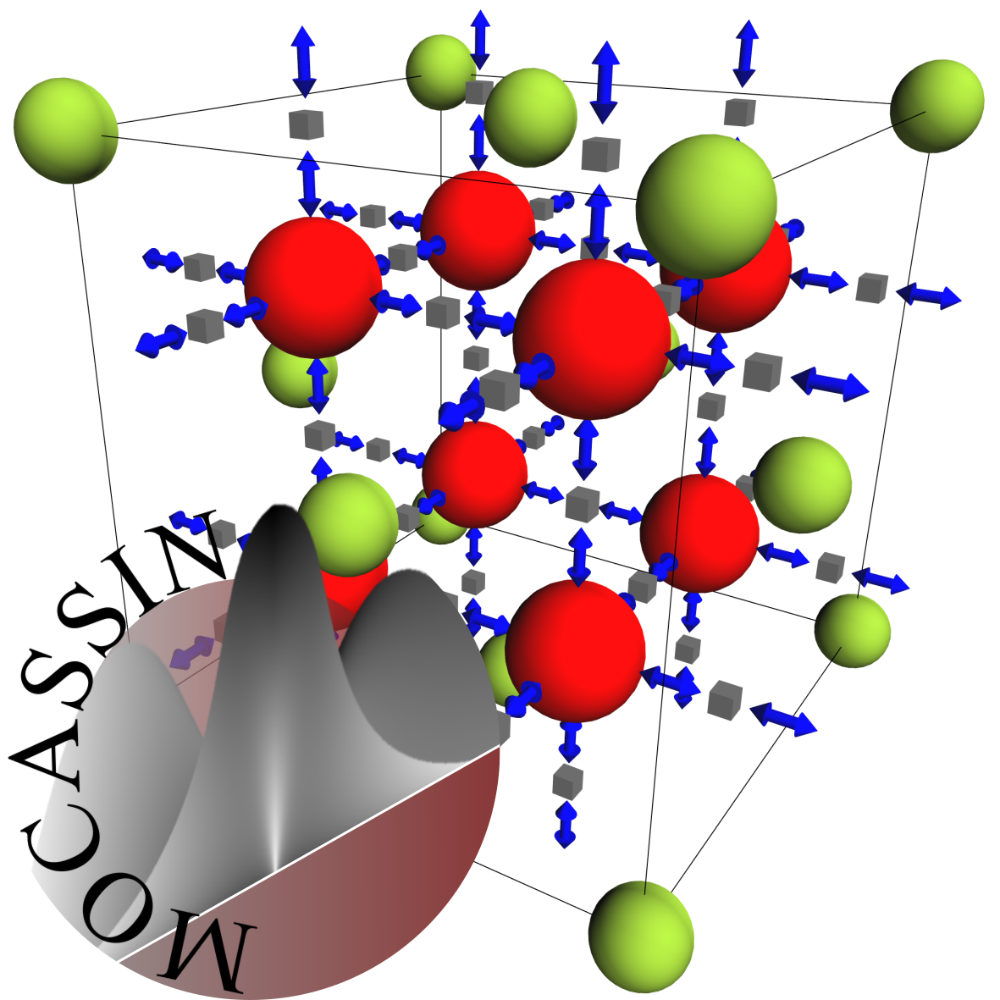

# MOCASSIN Readme

## What is MOCASSIN?
MOCASSIN stands for "Monte Carlo for Solid State Ionics" and is a Markov Chain Monte Carlo program for simulations of defects in crystalline solids, primarily solid electrolytes. It supports both Kinetic (KMC) and Metropolis Monte Carlo (MMC) simulations in a unified manner based on ideal crystal structures with fixed positions and symmetry processing with space groups. This allows MOCASSIN to process arbitrary crystal geometries and greatly reduces the input effort by reducing the data to a symmetry reduced set. It is intended for highly customizable energy models where pair and cluster interactions can be directly modelled from first principles energy calculations.

The system was developed as a PhD project by RWTH Aachen University / Germany and Forschungszentrum Jülich GmbH / Germany. Please refer to the affiliated open access publication for further information. (http://dx.doi.org/10.1002/jcc.26418)



## What platforms are supported?
The system is developed for x86-64 as this is the most common processor type in high performance computing (HPC). 32-bit operating systems are not supported.

The C# model builder source code targets .NET Standard 2.0 and is Windows/Linux/MacOS portable. The C source is written for GNU GCC and Intel ICC compilers and can also be compiled for Windows/Linux, the MSVC compiler is not supported. The current graphical user interface (GUI) uses WPF and DirectX 10/11 and is Win64 only.

## How to build?
The WPF GUI comes with a Visual Studio solution file and should be compiled with Visual Studio or another appropriate IDE. The .NET Standard 2.0 libraries can also be compiled using the dotnet CLI command.

To compile the solver components on Linux systems ensure that CMake, Make, and a current GNU GCC or Intel ICC is installed. Than either execute the included "linux-build" shell script or execute the following commands in the "McSolver" root directory:

```bash
mkdir 'build'
cmake -B './build' -D"CMAKE_BUILD_TYPE=Release"
cd './build'
make
```

To the compile the solver on Win64 systems, install CMake for Windows (https://cmake.org/download/) and an appropriate toolchain that supplies the Win64 ports of GCC and make. E.g., install MSYS2 (https://www.msys2.org/) and install the affiliated MinGW toolchain components using pacman:

```bash
pacman -S mingw-w64-x86_64-toolchain
```

Assuming that your MSYS2 root directory is "C:\\msys2\\" you can use the "win64-build" script or do the steps by hand as soon as the toolchain is installed.
```PowerShell
mkdir -Force "./build"
cmake -B "./build" -G "MinGW Makefiles" -D"CMAKE_MAKE_PROGRAM:PATH=C:\msys64\mingw64\bin\mingw32-make.exe" -D"CMAKE_BUILD_TYPE=Release"
cd "./build"
Invoke-Expression "C:\msys64\mingw64\bin\mingw32-make.exe"
```

## Using the simulator
Using the simulator "Mocassin.Simulator" (Linux) or "Mocassin.Simulator.exe" (Windows) requires at least the mandatory CMD arguments:
- "-dbPath": The path to the simulation job library (*.msl)
- "-ioPath": The path to the directory that will be used for I/O operations
- "-jobId": The ID of the job model data to be queried from the "*.msl" file
```bash
Mocassin.Simulator -dbPath <file> -jobId <integer> -ioPath <directory>
```
Additional optional arguments exist:
- "-stdout": Provide a filename for automated redirect of the stdout stream. The file is automatically written into the I/O directory specified by "-ioPath"
