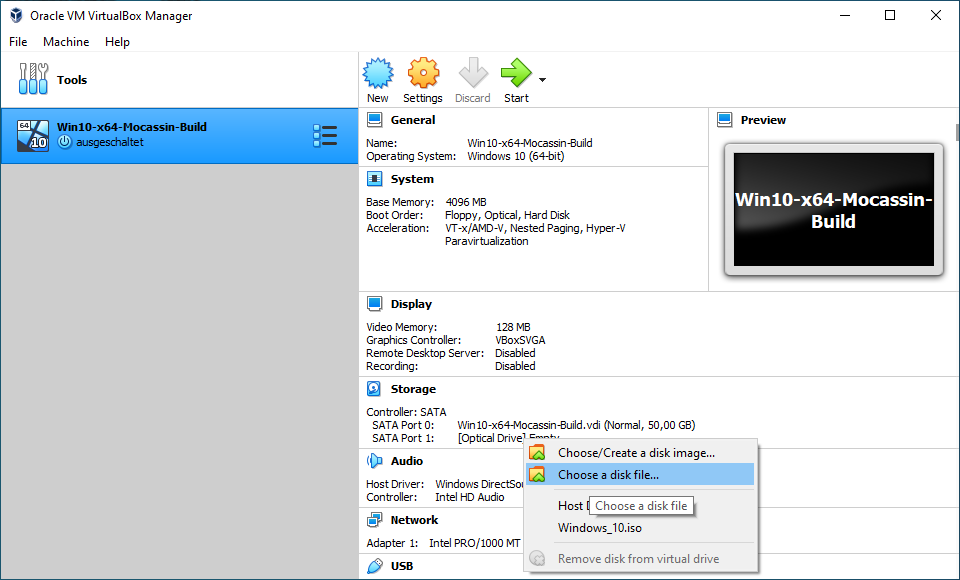
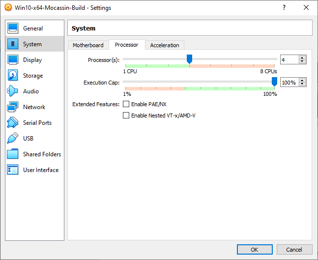
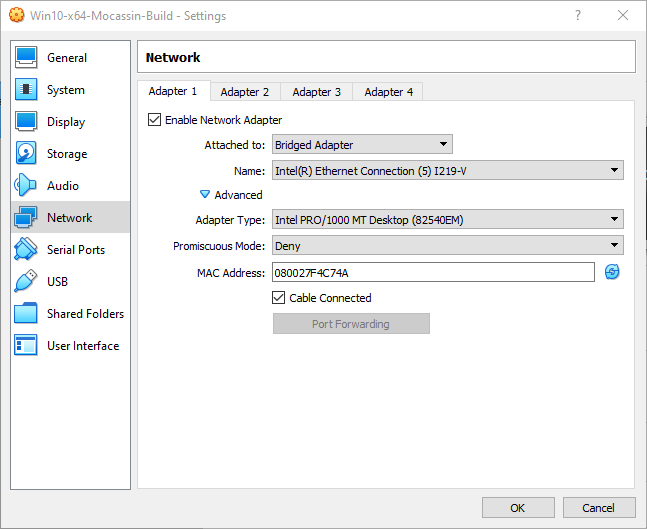
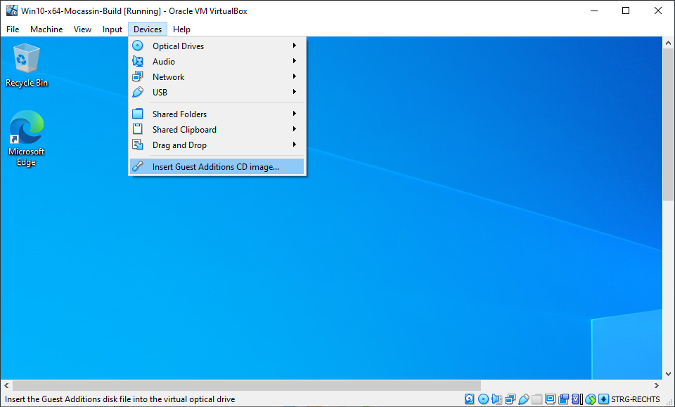
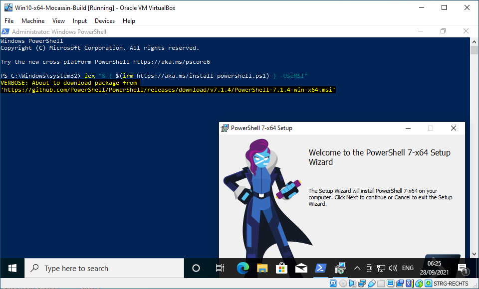
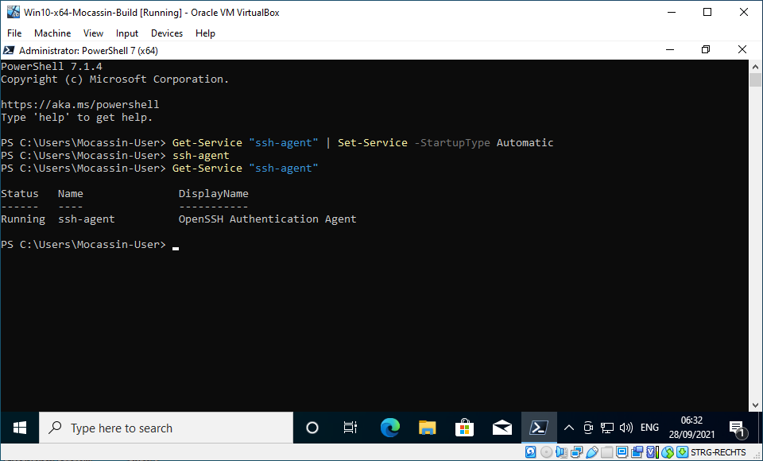
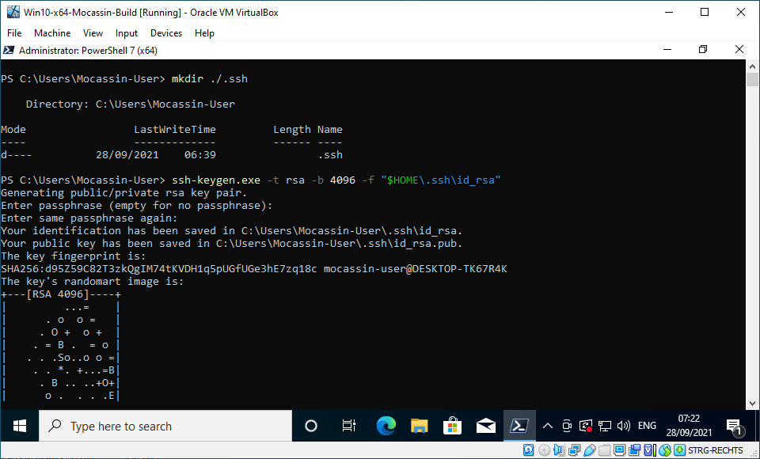

# MOCASSIN Build-VM Setup Guide

## Preface

*The following guide explains how to setup a build VM for MOCASSIN with remote compilation of the simulator executable on the RWTH Aachen HPC system. Steps that are specific to the RWTH system and may require changes for other environments are marked explicitly. All shown command line inputs are for the PowerShell.*

## Setting up Virtual Box and a x64-Win10 VM

**Important: Execute the following steps in the host machine or the VM as instructed. All other chapters are execute on the VM only.**

- Download the [Windows Media Creation Tool](https://www.microsoft.com/de-de/software-download/windows10)
  - Start the tool and follow the displayed steps to download a Windows 10 x64 ISO to a local drive


- Download and install [Virtual Box](https://www.virtualbox.org/) for your host system
  - Start Virtual Box and select the **New** dialog from the tools menu
  - Name the new VM and select **Microsoft Windows** as the operating system and **Windows 10 (64-bit)** as the version
  - Follow the instructions of the setup dialog and select **4 GB** of virtual RAM and the recommended **50 GB** as the virtual hard drive size
  - Select the newly created machine on the selection menu on the left and and click on the **optical drive (SATA Port 1)** and select the **Win10 ISO** downloaded earlier as shown below

  <figure style="text-align: center; margin: 10">
    
    <figcaption>
    Figure: Insert an ISO from a local disk into the optical drive of the VM.
    </figcaption>
  </figure>

  - Start the VM and follow the **Windows 10 (64-bit)** installation process. Create and installation of **Windows 10 Pro** without a product key. It is recommended to create an **Offline-Account** with a **User** without a password.
  - Close the VM when the installation process of the OS is completed and remove the ISO from the virtual optical drive of the VM.
  - Open the **Settings** dialog of the VM and go to **System > Processor** and set the number of processors available to the VM to at least **two cores** as shown below.

  <figure style="text-align: center; margin: 10">
    
    <figcaption>
    Figure: Set the available number of CPU cores for the VM.
    </figcaption>
  </figure>

  - **Optional for VPN login:** Open the **Settings** dialog of the VM and go to **Network > Adapter 1** and switch the adapter type from **NAT** to **Bridged Adapter** as shown below (Leave all settings at the default value for wired connections or set the **Adapter type** to **MT Server** for WLAN connections). This setting allows the VM to enter a VPN without the host system having to enter the same network.

  <figure style="text-align: center; margin: 10">
    
    <figcaption>
    Figure: Change the network adapter of the VM to a bridged adapter.
    </figcaption>
  </figure>

  - Start the VM and from the **Virtual Box Menu Bar** at the top select **Devices > Insert Guest Addition CD Image** as shown below.

  <figure style="text-align: center; margin: 10">
    
    <figcaption>
    Figure: Insert the guest additions image into the optical drive.
    </figcaption>
  </figure>

  - Go to **This PC** in the running VM and install the **Guest Additions** by double-clicking the CD drive. Use the default settings during installation and reboot the VM.
  - Eject the **Guest Additions Disk** and set the display resolution of the VM to your liking.
  - **Optional:** Set the **User Account Control** in the VM's Windows 10 to the lowest setting to prevent constant confirmation prompts by the system.

## Installing PowerShell 7+ and setting up SSH for the VM & remote hosts

- Start a **Windows PowerShell** session as an administrator
- Start the install process of **PowerShell 7+** by executing the following command, follow the instructions and ensure that adding the PowerShell to **PATH** is enabled during installation. Close the elevated **PowerShell** session after completion of the installation.

  ```PowerShell
  iex "& { $(irm https://aka.ms/install-powershell.ps1) } -UseMSI"
  ```

<figure style="text-align: center; margin: 10">
    
    <figcaption>
    Figure: Install the PowerShell 7+ from the Windows PowerShell.
    </figcaption>
</figure>

- Start a **PowerShell 7+** session as an administrator and enable the **ssh-agent** service to start automatically, start the service, and check if its running by executing the following commands:

  ```PowerShell
  Get-Service "ssh-agent" | Set-Service -StartupType Automatic
  Start-Service "ssh-agent"
  Get-Service "ssh-agent"
  ```

<figure style="text-align: center; margin: 10">
    
    <figcaption>
    Figure: Set the "ssh-agent" service to start automatically and check if the service starts correctly.
    </figcaption>
</figure>

- Create the default **SSH folder**, generate a new **SSH Key** for the VM, and add it to the **ssh-agent** executing the following commands (you have to choose and input a passphrase for the key multiple times):

  ```PowerShell
  cd $HOME
  mkdir ./.ssh

  ssh-keygen.exe -t rsa -b 4096 -f "$HOME/.ssh/id_rsa"
  ssh-add.exe "$HOME/.ssh/id_rsa"
  ```

<figure style="text-align: center; margin: 10">
    
    <figcaption>
    Figure: Generate a new ssh key and choose a passphrase.
    </figcaption>
</figure>

- **Execute this step for all remote Linux hosts you want to create simulator compilations for:** Register your machine as a known host to the remote Linux build target by running the following commands. Replace **[HOSTNAME]** by the address of the target machine and **[USERNAME]** by your login name for that machine (you will be prompted for a password):

  ```PowerShell
  $USER_AT_HOST = "[USERNAME]@[HOSTNAME]"
  $PUBKEY_CONTENT = (Get-Content "$HOME/.ssh/id_rsa.pub" | Out-String)
  ssh "$USER_AT_HOST" "mkdir -p ~/.ssh && chmod 700 ~/.ssh && echo '$PUBKEY_CONTENT' >> ~/.ssh/authorized_keys && chmod 600 ~/.ssh/authorized_keys"
  ```

- **Optional:** Test the connection by entering the following command, the VM should then connect to the remote target without prompting for a password:

  ```PowerShell
  ssh "[USERNAME]@[HOSTNAME]"
  ```

## Installing Git and cloning the MOCASSIN repository

- Download and install [Git for Windows](https://gitforwindows.org/). During installation set that the SSH applications found on **PATH** should be used. Leave all other options at their default values.
- Clone the **MOCASSIN repository master branch** into "$HOME/source/Mocassin" by executing the following commands:

  ```PowerShell
  cd $HOME
  mkdir source
  cd source
  git clone "https://github.com/seb-eis/Mocassin.git"
  ```

## Installing the tools for documentation conversion

- Download the latest version of [KaTeX](https://github.com/seb-eis/Mocassin.git) as a zip file and extract the contents of the **"katex"** folder to **"$HOME/source/Mocassin/build/katex"**
- Download and install the latest version of [Pandoc](https://github.com/seb-eis/Mocassin.git) using the MSI.

## Installing the tools for .NET

- Download the latest version of [Visual Studio Community 2019](https://visualstudio.microsoft.com/de/thank-you-downloading-visual-studio/?sku=Community&rel=16) and choose **.NET Desktop Development** and **.NET Cross Platform Development** as the target usage during the installation.
- Install the [VSSetup PowerShell Module](https://github.com/microsoft/vssetup.powershell) by using the following command and answering the prompt with **Yes**:

  ```PowerShell
  Install-Module VSSetup -Scope CurrentUser
  ```

- Download and install the [.NET Framework 4.8 Developer Pack](https://dotnet.microsoft.com/download/dotnet-framework/net48)
- Type *Windows Features* into the Windows search bar and open the **Turn Windows features on/off** control. Find and activate the **.NET Framework 3.5** option and let Windows download and install the files. (**This step is required for WiX Toolset 3.11.2 and below and may not be required for future versions**)
- Download and install the latest version of the [WiX Toolset](https://wixtoolset.org/releases/).
- Go to **"$HOME/source/Mocassin/src/ModelBuilder"** and open the **Mocassin.ModelBuilder.sln** file with **Visual Studio Community 2019**. The system is going to migrate the solution, ignore the errors about the **WiX Project** not being supported. Set the build config to "x64" and the the **Solution Explorer** right click the **"Mocassin.UI.GUI"** project and select **Build**. Make sure that the build process succeeds and close **Visual Studio**.

## Setting up GNU GCC and CMake for Windows
- Download and install the latest version of [CMake](https://cmake.org/download/) for Windows and check **"Add CMake to PATH for current user"** during the process
- Download and install the latest version of [MSYS2](https://www.msys2.org/) into **"C:\msys64"** which brings the **MinGW64 Toolchain**. Just follow the excellent guide on https://www.msys2.org/ which also covers the installation of the MinGW64 toolchain using the **pacman** command.
- **Optional:** After settings up the toolchain it is recommended to test if the commands `gcc` and `make` are functioning. For that run **MSYS MinGW 64-bit** from the start menu and type in the following commands:

  ```bash
  gcc --version
  make --version
  ```

- Add **"C:/msys64/mingw64/bin"** to be auto-added to path with the PowerShell profile using the following command in the PowerShell (**Correct quotation is important!**), this makes the tools `gcc` and `mingw32-make` available from the PowerShell:

  ```PowerShell
  '$env:Path += ";C:\msys64\mingw64\bin"' >> $profile
  ```

## Setting up and testing the build system

**Important:** For this step it is recommended to install [Visual Studio Code](https://code.visualstudio.com/) as a code editor on the VM and install the affiliated **PowerShell Extension**.

- Make sure that **nuget.org** is a known package source for `dotnet` by entering the following commands:

  ```PowerShell
  dotnet nuget list source

  # Execute this line only if the entry is missing from the list
  dotnet nuget add source "https://api.nuget.org/v3/index.json" --name "nuget.org"
  ```

- Download the **nuget.exe** CLI from https://dist.nuget.org/win-x86-commandline/latest/nuget.exe, place it into **"$HOME/source"** and make it available with the **PATH**:

  ```PowerShell
  '$env:Path += ";$HOME\source"' >> $profile
  ```

- Create a copy of the **build-mocassin-template.json** to get the active json file that controls the MOCASSIN build scripts by running the following command:

  ```PowerShell
  cp "$HOME/source/Mocassin/build/build-mocassin-template.json" "$HOME/source/Mocassin/build/build-mocassin-active.json"
  ```

- Open the created **build-mocassin-template.json** file and make the following changes to the file:
  - Find the **"LinuxRemotes"** array entry and add all target remote host information. The **"PreBuildCommands"** will be executed on the Linux host before the build process is started.
  - Find the **"Scripts"** array entry and set all **"IsActive"** entries to  *true*
  - Your JSON file should now contain the entries as shown below:

    ```json
    "LinuxRemotes": [
        {
            "Name": "centos",
            "Host": "user@examplehost.com",
            "PreBuildCommands": [
                "module unload gcc",
                "module load gcc/10"
            ]
        }
    ]
    ...
    "Scripts": [
        {
            "Path": "./subscripts/build-documentation.ps1",
            "IsActive": true
        },
        {
            "Path": "./subscripts/build-solver-linuxremote.ps1",
            "IsActive": true
        },
        {
            "Path": "./subscripts/build-solver-local.ps1",
            "IsActive": true
        },
        {
            "Path": "./subscripts/build-gui-installer.ps1",
            "IsActive": true
        },
        {
            "Path": "./subscripts/build-nuget-local.ps1",
            "IsActive": true
        }
    ],
    ```

- Open the PowerShell profile file in a code editor of your choice. for VS Code type in the following line in the PowerShell:

  ```PowerShell
  code $profile
  ```

- Add the following **PowerShell** code to the file and save the file:

  ```PowerShell
  function Build-Mocassin {
      [CmdletBinding()]
      param (
          [Parameter(Position=0, ValueFromPipeline)]
          [string]    
          $SourcePath = "$HOME\source\Mocassin"
      )
    
      begin {
          Write-Host "Building Mocassin in: $SourcePath"
      }
    
      process {
          Write-Host "Updating repository and restoring ... "
          Set-Location $SourcePath
          git pull
          Set-Location "$SourcePath/src/ModelBuilder"
          dotnet restore
          Set-Location $SourcePath
          Write-Host "Running build scripts with active config JSON"
          Set-Location "$SourcePath/build"
          & "./build-mocassin.ps1"
      }
  }
  ```

- Open a new **PowerShell** session and test the build process by entering the following command:

  ```PowerShell
  Build-Mocassin
  ```

- If the process is successful there should be a new folder **"$HOME/source/Mocassin/build/deploy/1.1.X.Y"**, where **X** and **Y** are auto generated version numbers. You can navigate to the folder and use the **"tree /F"** command in the PowerShell to check the file tree. It should look like this, with some version number changes:

  ```txt
  Folder PATH listing
  Volume serial number is 7CC9-AC6A
  C:.
  │   build.log
  │   tree.txt
  │   
  ├───doc
  │   └───guide-pages
  │       │   api-mcs-file-contents.html
  │       │   api-model-project-and-context.html
  │       │   api-msl-evaluation-context.html
  │       │   api-preparing-for-analysis.html
  │       │   api-ready-evaluation-classes.html
  │       │   building-mocassin.html
  │       │   energy-model.html
  │       │   installation.html
  │       │   job-templates.html
  │       │   lattice-model.html
  │       │   mmcfe-routine.html
  │       │   movement-tracking.html
  │       │   parameterization-templates.html
  │       │   particle-model.html
  │       │   preface.html
  │       │   readme.html
  │       │   simulation-model.html
  │       │   structure-model.html
  │       │   the-simulation-database.html
  │       │   the-simulator.html
  │       │   transition-model.html
  │       │   ui-3d10-viewer.html
  │       │   ui-energy-control.html
  │       │   ui-job-template-control.html
  │       │   ui-lattice-control.html
  │       │   ui-managing-projects.html
  │       │   ui-parameterization-control.html
  │       │   ui-particle-control.html
  │       │   ui-simulation-build-control.html
  │       │   ui-simulation-control.html
  │       │   ui-structure-control.html
  │       │   ui-transition-control.html
  │       │   under-construction.html
  │       │   
  │       ├───figures
  │       │   ├───png
  │       │   │       JumphistogramCeria.png
  │       │   │       KmcFlowDiagram.png
  │       │   │       Logo.png
  │       │   │       MmcFlowDiagram.png
  │       │   │       ui-3d10-model-control.png
  │       │   │       ui-3d10-viewer-empty.png
  │       │   │       ui-3d10-viewer-parameterization-overlay.png
  │       │   │       ui-3d10-viewer-settings-overlay.png
  │       │   │       ui-assign-transitions-to-simulation.png
  │       │   │       ui-create-model.png
  │       │   │       ui-create-project.png
  │       │   │       ui-define-cellsite.png
  │       │   │       ui-define-doping.png
  │       │   │       ui-define-group-interaction.png
  │       │   │       ui-define-job-collection.png
  │       │   │       ui-define-job-config.png
  │       │   │       ui-define-job-translation-unit.png
  │       │   │       ui-define-kmc-transition.png
  │       │   │       ui-define-mmc-transition.png
  │       │   │       ui-define-occupation-exchange.png
  │       │   │       ui-define-particle-set.png
  │       │   │       ui-define-particle.png
  │       │   │       ui-define-stable-environment.png
  │       │   │       ui-define-state-change-chain.png
  │       │   │       ui-define-state-change-group.png
  │       │   │       ui-define-state-change.png
  │       │   │       ui-define-unstable-environment.png
  │       │   │       ui-deploy-msl-to-localhost.png
  │       │   │       ui-energy-control.png
  │       │   │       ui-interaction-customization.png
  │       │   │       ui-lattice-control.png
  │       │   │       ui-manage-model-project.png
  │       │   │       ui-mmcfe-config.png
  │       │   │       ui-mmcfe-eval-tool.png
  │       │   │       ui-model-validator.png
  │       │   │       ui-particle-control.png
  │       │   │       ui-refresh-defect-energy-grid.png
  │       │   │       ui-simulation-control.png
  │       │   │       ui-space-group-and-parameters.png
  │       │   │       ui-structure-control.png
  │       │   │       ui-targeting-a-job-template.png
  │       │   │       ui-targeting-a-parameterization.png
  │       │   │       ui-transition-control.png
  │       │   │       ui-transition-rule-customization.png
  │       │   │       ui-view-default-building-block.png
  │       │   │       
  │       │   └───raw
  │       │           JumphistogramCeria.svg
  │       │           KmcFlowDiagram.svg
  │       │           mmcfe-series-samples.svg
  │       │           MmcFlowDiagram.svg
  │       │           
  │       ├───katex
  │       │   │   katex.css
  │       │   │   katex.js
  │       │   │   katex.min.css
  │       │   │   katex.min.js
  │       │   │   katex.mjs
  │       │   │   README.md
  │       │   │   
  │       │   ├───contrib
  │       │   │       auto-render.js
  │       │   │       auto-render.min.js
  │       │   │       auto-render.mjs
  │       │   │       copy-tex.css
  │       │   │       copy-tex.js
  │       │   │       copy-tex.min.css
  │       │   │       copy-tex.min.js
  │       │   │       copy-tex.mjs
  │       │   │       mathtex-script-type.js
  │       │   │       mathtex-script-type.min.js
  │       │   │       mathtex-script-type.mjs
  │       │   │       mhchem.js
  │       │   │       mhchem.min.js
  │       │   │       mhchem.mjs
  │       │   │       render-a11y-string.js
  │       │   │       render-a11y-string.min.js
  │       │   │       render-a11y-string.mjs
  │       │   │       
  │       │   └───fonts
  │       │           KaTeX_AMS-Regular.ttf
  │       │           KaTeX_AMS-Regular.woff
  │       │           KaTeX_AMS-Regular.woff2
  │       │           KaTeX_Caligraphic-Bold.ttf
  │       │           KaTeX_Caligraphic-Bold.woff
  │       │           KaTeX_Caligraphic-Bold.woff2
  │       │           KaTeX_Caligraphic-Regular.ttf
  │       │           KaTeX_Caligraphic-Regular.woff
  │       │           KaTeX_Caligraphic-Regular.woff2
  │       │           KaTeX_Fraktur-Bold.ttf
  │       │           KaTeX_Fraktur-Bold.woff
  │       │           KaTeX_Fraktur-Bold.woff2
  │       │           KaTeX_Fraktur-Regular.ttf
  │       │           KaTeX_Fraktur-Regular.woff
  │       │           KaTeX_Fraktur-Regular.woff2
  │       │           KaTeX_Main-Bold.ttf
  │       │           KaTeX_Main-Bold.woff
  │       │           KaTeX_Main-Bold.woff2
  │       │           KaTeX_Main-BoldItalic.ttf
  │       │           KaTeX_Main-BoldItalic.woff
  │       │           KaTeX_Main-BoldItalic.woff2
  │       │           KaTeX_Main-Italic.ttf
  │       │           KaTeX_Main-Italic.woff
  │       │           KaTeX_Main-Italic.woff2
  │       │           KaTeX_Main-Regular.ttf
  │       │           KaTeX_Main-Regular.woff
  │       │           KaTeX_Main-Regular.woff2
  │       │           KaTeX_Math-BoldItalic.ttf
  │       │           KaTeX_Math-BoldItalic.woff
  │       │           KaTeX_Math-BoldItalic.woff2
  │       │           KaTeX_Math-Italic.ttf
  │       │           KaTeX_Math-Italic.woff
  │       │           KaTeX_Math-Italic.woff2
  │       │           KaTeX_SansSerif-Bold.ttf
  │       │           KaTeX_SansSerif-Bold.woff
  │       │           KaTeX_SansSerif-Bold.woff2
  │       │           KaTeX_SansSerif-Italic.ttf
  │       │           KaTeX_SansSerif-Italic.woff
  │       │           KaTeX_SansSerif-Italic.woff2
  │       │           KaTeX_SansSerif-Regular.ttf
  │       │           KaTeX_SansSerif-Regular.woff
  │       │           KaTeX_SansSerif-Regular.woff2
  │       │           KaTeX_Script-Regular.ttf
  │       │           KaTeX_Script-Regular.woff
  │       │           KaTeX_Script-Regular.woff2
  │       │           KaTeX_Size1-Regular.ttf
  │       │           KaTeX_Size1-Regular.woff
  │       │           KaTeX_Size1-Regular.woff2
  │       │           KaTeX_Size2-Regular.ttf
  │       │           KaTeX_Size2-Regular.woff
  │       │           KaTeX_Size2-Regular.woff2
  │       │           KaTeX_Size3-Regular.ttf
  │       │           KaTeX_Size3-Regular.woff
  │       │           KaTeX_Size3-Regular.woff2
  │       │           KaTeX_Size4-Regular.ttf
  │       │           KaTeX_Size4-Regular.woff
  │       │           KaTeX_Size4-Regular.woff2
  │       │           KaTeX_Typewriter-Regular.ttf
  │       │           KaTeX_Typewriter-Regular.woff
  │       │           KaTeX_Typewriter-Regular.woff2
  │       │           
  │       └───styles
  │               style.css
  │               
  ├───mocassin-nuget
  │       Mocassin.2021.9.29.nupkg
  │       Mocassin.Csx.1.0.0.nupkg
  │       Mocassin.Framework.2021.9.29.nupkg
  │       Mocassin.Mathematics.2021.9.29.nupkg
  │       Mocassin.Model.2021.9.29.nupkg
  │       Mocassin.Model.Translator.2021.9.29.nupkg
  │       Mocassin.Symmetry.2021.9.29.nupkg
  │       Mocassin.Tools.Evaluation.2021.9.29.nupkg
  │       Mocassin.Tools.UAccess.2021.9.29.nupkg
  │       Mocassin.UI.Data.2021.9.29.nupkg
  │       
  ├───mocassin-win64-gui
  │       Mocassin-1.1.7942.11770.msi
  │       
  ├───mocsim-linux-x86-64-centos
  │       libframework.so
  │       libjobloader.so
  │       libmmcfe.mocext.so
  │       libprogressprint.minimal.so
  │       libprogressprint.so
  │       libsimulator.so
  │       libsqlite3.so
  │       libutility.so
  │       Mocassin.Simulator
  │       Mocassin.Utility
  │       
  └───mocsim-win-x86-64
          libframework.dll
          libjobloader.dll
          libmmcfe.mocext.dll
          libprogressprint.dll
          libprogressprint.minimal.dll
          libsimulator.dll
          libsqlite3.dll
          libutility.dll
          Mocassin.Simulator.exe
          Mocassin.Utility.exe
          

  ```