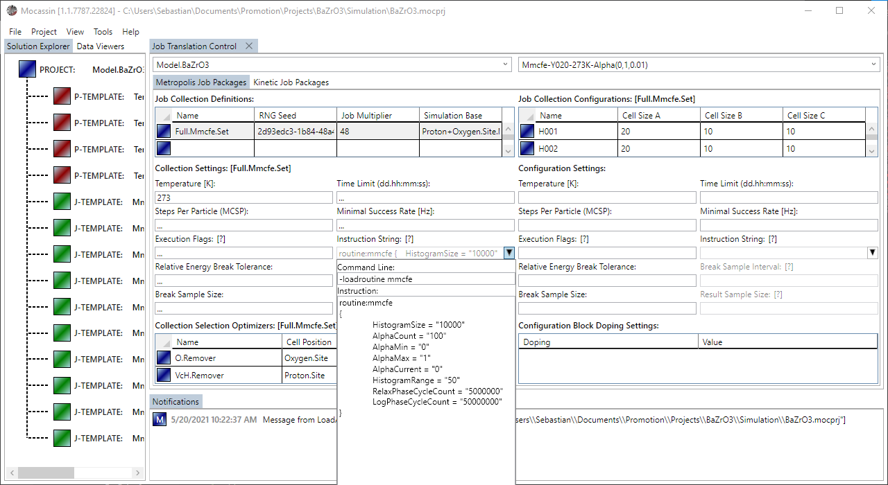
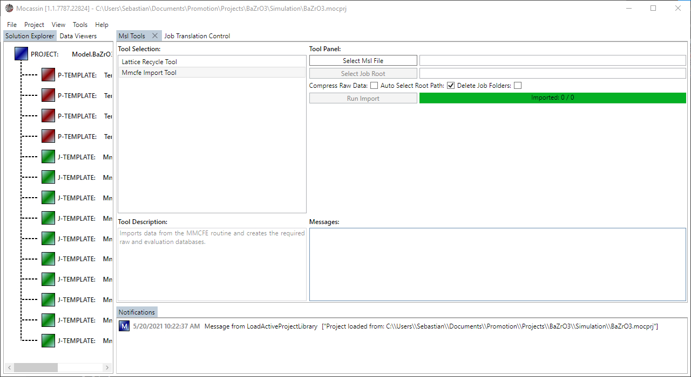

# The MMCFE custom routine for simulated annealing

## Basics

A very common variation of regular MMC simulations is simulated annealing. In this process, a series of MMC simulations with decreasing temperature is applied to a supercell. This way, lattice samples for a temperature series or an energy distributions series as required for the [multistage MMC principle](https://aip.scitation.org/doi/10.1063/1.1678245) by Valleau & Card can be generated with minimal effort.

Mocassin implements this principle as an extension routine that was originally designed to perform the multistage sampling to estimate the free energy and entropy of interaction for a system based on the recorded energy distributions. The extension is called MMCFE routine which stands for "Metropolis Monte Carlo Free Energy Routine".

## Usage and evaluation

### [The alpha parameter](#the-alpha-parameter)

For technical reasons, the temperature series in Mocassin is created by a parameter $\alpha\in[0...1]$ that is defined according to eq. (1), where $T_\mathrm{min}$ is the minimal temperature in the series and $T$ is the current temperature of the simulation, and then the range between a minimal and a maximal alpha is sampled with a constant stepping of $\Delta\alpha$.

$$
\alpha = \frac{T_\mathrm{min}}{T}
$$

Thus, $\alpha=0$ and $\alpha=1$ represent $T=\infty$ and $T_\mathrm{min}$, respectively. The Boltzmann probability used for transition probability comparison at each simulated $\alpha$ value $P(\alpha)$ is then defined according to eq. (2). Consequently, $\alpha=0$ leads to a distribution $\Omega'(E)$ that is a uniform random sample of the configuration space which is directly proportional to the real configuration space $\Omega(E)$.

$$
P(\alpha)=\exp\left(-\frac{\alpha \Delta E}{k_\mathrm{B}T_\mathrm{min}}\right)
$$

The alpha principle automatically leads to increased sample density at lower temperatures as illustrated in figure 1.

<figure style="text-align: center">
    
    <figcaption>
    Figure 1: Illustration of MMCFE sample points for an alpha stepping of 0.01 with a target temperature of 273 K.
    </figcaption>
</figure>

### [Configuration of an MMC job to use the MMCFE routine](#configuration-of-an-mmc-job-to-use-the-mmcfe-routine)

The MMCFE routine is automatically invoked by the simulator if the affiliated extension UUID and routine data package are added to the simulation database. This is achieved by configurating a job collection of a regular MMC simulation by setting the affiliated text in the "instruction string". When opening the affiliated context menu, the UI offers to either manually define the contents or use a command line "-loadroutine mmcfe" top load the affiliated template as shown in figure 2. The minimal temperature of the series $T_\mathrm{min}$ is equal to the temperature set for the MMC simulation.

<figure style="text-align: center">
    
    <figcaption>
    Figure 2: The MMCFE routine instruction string for a job collection loaded by the "-loadroutine mmcfe" command.
    </figcaption>
</figure>

Within the routine template, the following parameters can be defined to define the temperature series:

- **HistogramRange**: Defines the $\pm$ energy range (in eV) around an automatically determined average energy $E_\mathrm{avg}(T)$ in which energy distribution data $M(E,T)$ is collected. E.g., setting this value to 50 causes the histogram to record all energies in the range $E_\mathrm{avg}-\mathrm{50 ev}$ to $E_\mathrm{avg}+\mathrm{50 eV}$.
- **HistogramSize**: Defines the number of entries in the recorded energy distributions $M(E,T)$ that are distributed over the histogram range, that is, it defines the precision of the data collection. E.g., setting this value to 1000 and the histogram range to 50 leads to a sampling interval width of $\Delta E= \mathrm{0.1 eV}$. The size of the histogram scales linear with this number, thus, large values lead to a significant increase in disk space requirements.
- **AlphaMin**: Sets the minimal value of $\alpha \in [0...1)$ that is used to create the temperature series
- **AlphaMax**: Sets the maximum value of $\alpha \in (0...1]$ that is used to create the temperature series
- **AlphaCount**: Sets the number of alpha steps $N_\alpha$ for moving from the minimal $\alpha$ to the maximum $\alpha$, giving $N_\alpha+1$ MMC simulations in the series. The alpha step length is then defined as $\Delta\alpha=(\alpha_\mathrm{max}-\alpha_\mathrm{min})/N_\alpha$. It is generally recommended so set this value to something between 50 and 200. Very small values might lead to odd behavior for the $M(E,T)$ recording system.
- **AlphaCurrent**: Sets the current value of $\alpha$. This value should usually not be set do anything but zero.
- **RelaxPhaseCycleCount**: The number of MMC attempts that are performed in the relaxation phase of each temperature before collecting the $M(E,T)$ data. During this phase, $E_\mathrm{avg}$ is determined. It is recommended to set this to ~10% of the number of log steps.
- **LogPhaseCycleCount**: The number of state samples that will be collected into the distribution $M(E,T)$ before moving to the next $\alpha$ value. Only statistically rejected and accepted cases are recorded while site-blocking events will be discarded.

**Note:** It is generally recommended to define only one MMCFE job collection per simulation template when using the MMCFE routine as much more data is created than for a regular MMC simulation. This way, the later created evaluation databases can be kept clean.

### [Collection and evaluation of results](#collection-and-evaluation-of-results)

The Mocassin UI provides a tool that collects and evaluates all data from the MMCFE routine generated for a single simulation database. This tool generates a merged database which contains all raw data, including all $M(E,T)$ and simulation states obtained at each $\alpha$ step. It additionally created a cleaned database that contains only the meta information and the calculated values of the average internal energy of interaction $U_\mathrm{int}$ and free energy of interaction $F_\mathrm{int}$ for each created $M(E,T)$ as obtained using the series integration principle by Valleau & Card. The tool can be accessed by "Tools->Msl Tools" and then selecting "Mmcfe Import Tool" from the tool list as shown in figure 3.

To use the import tool, copy the the root folder where the ".msl" file is located and the "Job00001, Job00002,..." job folder structure (see [scripts documentation](https://github.com/scrollrad/Mocassin/tree/master/src/McSolver/Scripts)) has been placed by the startup scripts to your local machine and select the ".msl" file. The tool then automatically selects the job root and the import can be started. Depending on the amount of data, this process can take several minutes. The tool imports the data in small portions, but still the RAM consumption can easily reach 6 GB depending on the supercell and $M(E,T)$ sizes.

<figure style="text-align: center">
    
    <figcaption>
    Figure 3: The MMCFE routine evaluation tool in the UI that allows to collect and evaluate MMCFE jobs and performs the integration of the energy distributions according to Valleau and Card.
    </figcaption>
</figure>