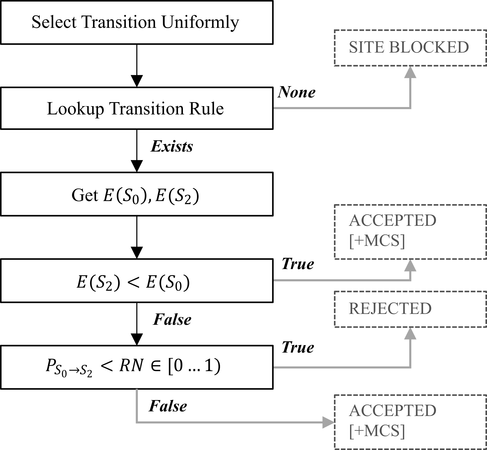
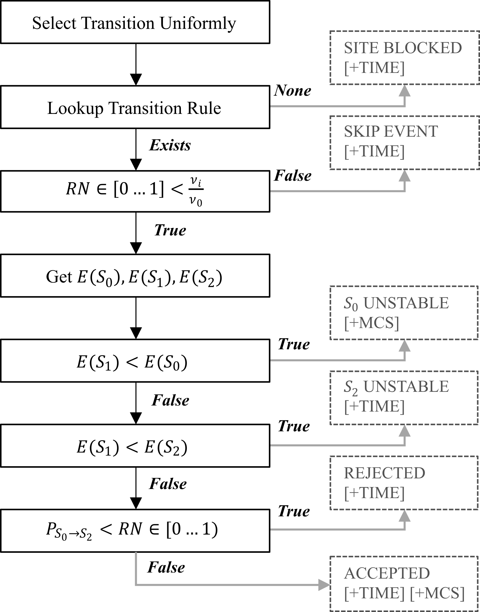
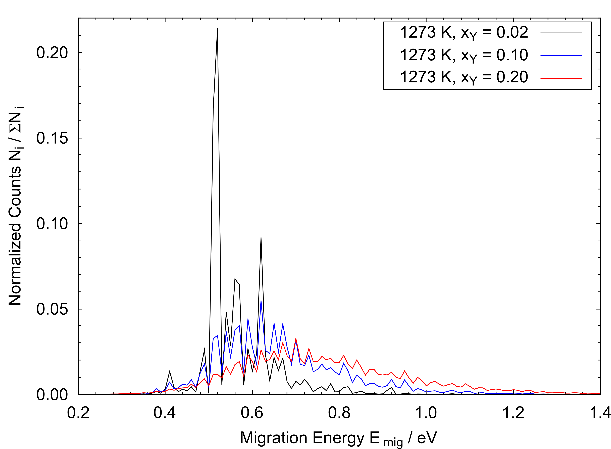

# The simulator

## Description

The Mocassin simulator is a Monte Carlo solver that processes both KMC and MMC data in a mostly unified fashion. It simulates the evolution of the system according to a MMC or rejection KMC principle in a 4D integer transformed supercell and is designed to handle even strongly interacting systems with acceptable performance.

## Information

### [Using the simulator](#using-the-simulator)

The simulator is started from the command line by calling "Mocassin.Simulator.exe" (Windows) or "Mocassin.Simulator" (Linux). The mandatory set of arguments includes the path to the simulation database by "-dbPath", the id of the job to process by "-jobId", and the path to the directory that should be used for I/O operations by "-ioPath". Its is additionally recommended to define "-stdout" to redirect the stdout stream to a file inside the I/O directory.

```sh
Mocassin.Simulator -dbPath <database> -jobId <jobnumber> -ioPath <directory> [-stdout <filename>]
```

Other important optional parameters include:

- -extDir \<directory\>
  - Defines a directory from which the simulator should load extension routines
- -jumpLogMaxEv \<energy in ev\>
  - Overwrites the maximum energy value for the KMC jump histogram logging. The default is 10 eV

The meta information to identify jobs can be found in the "JobMetaData" table of the simulation database (SQLite 3). The "JobMetaData" table has a "JobModelId" column containing the indices that are identical to the ones provided to "-jobId" on simulation startup. Further information on accessing the simulation database cam be found on the affiliated [documentation page](./the-simulation-database.md). 

**Note:** For advanced information on how to do scripted startups with parallel execution using multithreading or MPI on HPC clusters, consult the affiliated readme and source code in the solver [scripts directory](https://github.com/scrollrad/Mocassin/tree/master/src/McSolver/Scripts) of the Mocassin repository.

### [Random number generation](#random-number-generation)

Random number generation in Mocassin is based on the 32-bit version of the [Permuted Congruential Generator](https://www.pcg-random.org/index.html) (PCG) with 64 bit of state as introduces by M.E. O'Neill. The most basic function to generate a 32 bit unsigned integers is based on the minimal C implementation of a PCG32:

```cpp
// *Really* minimal PCG32 code / (c) 2014 M.E. O'Neill / pcg-random.org
// Licensed under Apache License 2.0 (NO WARRANTY, etc. see website)

// Typedef of the pcg32 rng. 'Inc' has to be an uneven number
typedef struct Pcg32 { uint64_t State;  uint64_t Inc; } Pcg32_t;

// Get next random uint32_t from the passed pcg32 rng
static inline uint32_t Pcg32NextRandom(Pcg32_t* rng)
{
    uint64_t oldstate = rng->State;
    rng->State = oldstate * 6364136223846793005ULL + rng->Inc;
    uint32_t xorshifted = (uint32_t) (((oldstate >> 18u) ^ oldstate) >> 27u);
    uint32_t rot = (uint32_t) (oldstate >> 59u);
    return (xorshifted >> rot) | (xorshifted << ((-rot) & 31u));
}
```

Generation of capped/ceiled random 32 bit integers without modulo bias in range [0...ceil) is done as shown in the PCG C++ code:

```cpp
//  Get the next random uint32_t from [0...ceil) without modulo bias using a pcg32
static inline uint32_t Pcg32NextCeiledRandom(Pcg32_t* rng, uint32_t ceil)
{
    let threshold = -ceil % ceil;
    for(;;)
    {
        let rnv = Pcg32NextRandom(rng);
        if(rnv >= threshold) return rnv % ceil;
    }
}
```

Generation of IEEE754 double precision floating point numbers in range [0...1) is done by creating a random 52 bit pattern for the mantissa with a special constant for the exponent, which yields a number in range [1...2), and then 1.0 is subtracted from the result. While it is not optimal to use a 32 bit generator to generate a 64 bit number, in practice no measurable difference to usual concepts that divide a random integer by a constant could be observed.

```cpp
// Get next random double in range [0.0,1.0) using a pcg32
static inline double Pcg32NextRandomDouble(Pcg32_t* rng)
{
    union { struct { uint32_t u0, u1; } u32; uint64_t u64; double f64; } random;
    random.u32.u0 = Pcg32NextRandom(rng);
    random.u32.u1 = Pcg32NextRandom(rng);
    random.u64 = 0x3FF0000000000000u | (random.u64 >> 12u);
    return random.f64 - 1.0;
}
```

### [The MMC routine](#the-mmc-routine)

The MMC routine simulates the time and space independent system evolution by particle swaps between sublattices as defined by the allowed set of Metropolis transitions of the used simulation model object. This process approaches the thermal equilibrium and minimizes the free energy of the system. The general routine cycle is shown in figure 1, where *+MCS* means that the system state is advanced by $S_0 \rightarrow S_2$. In contrast to the KMC routine, the MMC routine does not support a prerun as there is no automatic normalization.

<figure style="text-align: center">
    
    <figcaption>Figure 1: The basic MMC simulation routine cycle with conditions and possible cycle outcomes.</figcaption>
</figure>

### [The KMC routine](#the-kmc-routine)

The KMC routine simulates the time and space dependent evolution of the system as defined by the allowed set of kinetic transitions of the used simulation model object. The routine supports a prerun for relaxation of the system and automatic normalization. The general routine cycle is shown in figure 2, where *+TIME* means that the simulated time span is increased by the timestep of the current lattice state $\Delta t (S_0)$ as defined by (1) as the inverse value of the sum of all attempt frequencies $\nu_i$ of all selectable transitions $i$ that exist in the supercell during $S_0$ and a normalization constant $K_\text{norm}$ as described in the [normalization section](#kmc-normalization).

$$
\Delta t(S_0) = \left(\sum_i \nu_i\right)^{-1} \cdot K_\text{norm}
\tag{1} 
$$

<figure style="text-align: center">
    
    <figcaption>Figure 2: The basic KMC simulation routine cycle with conditions and possible cycle outcomes.</figcaption>
</figure>

There are three special cycle outcomes: (i) skip event, which is used to model different attempt frequencies; (ii) the rare $S_0$ unstable event, that is, the $S_0 \rightarrow S_2$ state change of the selected transition has a negative energy barrier in the defined energy model; and (iii) the $S_2$ unstable event, that is, the $S_2 \rightarrow S_2$ backwards state change of the selected transition has a negative energy barrier.

**Note:** It is possible to have nudged elastic band (NEB) calculations for migration barriers that fail due to an extremely unstable $S_0$ or $S_2$ state of the system. Thus, interpretation of wherever unstable end/start events in a simulation are a fragment of the energy modelling system or something to be expected for the system in question is always up to the user.

### [KMC normalization](#kmc-normalization)

Both rejection KMC and rejection free KMC with rate catalogues have advantages and disadvantages. A major disadvantage of the rejection KMC algorithm is its dependence of MCS rate on temperature and energy barrier. The lower the temperature and the higher the average energy barrier, the lower the probability of success as shown in (2).

$$
P_i=\exp{\left( -\frac{\Delta E_i}{k_\mathrm{B}T} \right)}
\tag{2}
$$

This can be partially fixed by two different types of normalization that can also be combined: (i) bias free, by normalizing to the highest transition probability occurring in the system, which can be determined automatically during the prerun; (ii) with bias, by shifting all transitions according to a new upper acceptance energy $\Delta E_\mathrm{norm} \neq 0$ below which all jumps are automatically accepted. The two respective normalization constants $K_\mathrm{auto}$ and $K_\mathrm{fix}$ as shown in (3) and (4) can then be multiplied to form a total constant $K_\mathrm{norm}$ as shown in (5). It should be noted that once $K_\mathrm{fix} \neq 1$ then $K_\mathrm{auto}$ is also no longer a bias free normalization.

$$
K_\mathrm{fix} = \exp{\left( -\frac{\Delta E_\mathrm{norm}}{k_\mathrm{B}T} \right)}^{-1}
\tag{3}
$$
$$
K_\mathrm{auto} = (P_\mathrm{max})^{-1}
\tag{4}
$$
$$
K_\mathrm{norm} = K_\mathrm{auto} \cdot K_\mathrm{fix}
\tag{5}
$$

The overnormalization using $K_\mathrm{fix}$ usually introduces a very small bias as transitions with low energies are usually only a small fraction of the energy landscape as illustrated in the energy histograms in figure 3.

<figure style="text-align: center">
    
    <figcaption>Figure 3: Energy barrier histograms of KMC simulations of oxygen 1NN migration in doped ceria at different yttrium fractions as created with Mocassin.</figcaption>
</figure>

### [Stdout format](#stdout-format)

While the current simulation state is stored as [binary dump files](./simulation-state-file.md) that can only be decoded using the C# API, the simulator additionally produces a human readable text dump to the stdout stream that contains the usual properties of interest. Among some meta and optimization information not detailed here, the dump contains statistics entries about the simulation and the particle ensembles, which are written after reaching specific progress milestones (every ~1% of MCSP) of the simulation. The statistics looks like this, with added comments to explain the entries:

```sh
<STATISTICS_DUMP>
# The number of completed MCS, target MCS, and the percentage
Status => Completion               : [             ] 10097567 /1000100000 +1.010e+000%
# The number of completed prerun MCS, target MCS, and the percentage
Status => Pre run completion       : [             ] 100000   /    100000 +1.000e+002%
# The total number of performed simulation cycles
Cycles => Total                    : [             ] 10300000             +1.000e+002%
# The number of simulation cycles with +MCS outcome and the percentage value
Cycles => Success                  : [             ] 10097567             +9.803e+001%
# The runtime of the program
Time => Program running            : [ISO8601      ] P00DT00H00M01S       +4.401e-006%
# The estimated time amount till reaching the target MCSP and the consumed percentage of the total allowed runtime
Time => Completion ETA             : [ISO8601      ] P00DT00H02M16S       +4.313e-004%
# The timespan that was simulated for the system
Time => Simulated                  : [s            ] +7.366583808425e+009 
# The average runtime per simulation cycle
Time => Per cycle                  : [s            ] +1.347572815534e-007 
# The average runtime per simulation block
Time => Per block                  : [s            ] +1.387000000000e+000 
# The average number of simulation cycles per second of runtime
Rate => Cycle                      : [Hz           ] +7.420749279539e+006 
# The average number of simulation MCS per second of runtime
Rate => Mcs                        : [Hz           ] +7.274904178674e+006 
# The energy of the lattice at the time the dump was created
Energy => Lattice                  : [eV           ] +0.000000000000e+000 
# The energy fluctuation since the last break check (MMC only)
Energy => Abort fluctuation        : [eV           ] +0.000000000000e+000 +0.000e+000%
# The current probability normalization factor calculated as K_norm = K_fix * K_tot
Probability => Norm. Factor        : [             ] +2.888856395003e+018 
```

Ensemble statistics dumps are created for all particles on routine startup and then only for species that are mobile during simulation. The ensembles are indexed as defined in the underlying model. All data that is given as vector information uses the Cartesian $(x,y,z)$ system. It is important that diffusion coefficients are only useful if the MSD affiliated with the direction is not affected by the electric field.

```sh
# This is the dump for the first particle that was defined in the model
<PARTICLE_DUMP ID=1 CHARGE=+1.00e+000 COUNT=9900)>
# The particle density, this value should never change over the course of the simulation
Particle density                   : [m^-3         ] +9.900000000000e+029 
# The number of cycles that used a particle from this ensemble as the starting point of a transition
Cycles => Total                    : [             ] 0                    +0.000e+000%
# The number of cycles that used a particle from this ensemble as the starting point of a transition an resulted in an MCS
Cycles => Success                  : [             ] 0                    +0.000e+000%
# The number of cycles that used a particle from this ensemble as the starting point of a transition an resulted in a SKIP event
Cycles => Skipped                  : [             ] 0                    +0.000e+000%
# The number of cycles that used a particle from this ensemble as the starting point of a transition an resulted in a rejected step
Cycles => Rejected                 : [             ] 0                    +0.000e+000%
# The number of cycles that used a particle from this ensemble as the starting point of a transition an resulted in a site blocked event
Cycles => Site blocked             : [             ] 0                    +0.000e+000%
# The number of cycles that used a particle from this ensemble as the starting point of a transition an resulted in a S_0 unstable event
Cycles => Start unstable           : [             ] 0                    +0.000e+000%
# The number of cycles that used a particle from this ensemble as the starting point of a transition an resulted in a S_2 unstable event
Cycles => End unstable             : [             ] 0                    +0.000e+000%
# The ensemble conductivity as calculated from linear response theory and projected onto the electric field vector
Conductivity => Field direction    : [S m^-1       ] +inf
# The ensemble conductivity as calculated from linear response theory, projected onto the electric field vector, and then normalized to a particle charge of +1
Conductivity => Normalized (z=+1)  : [S m^-1       ] +inf
# The ensemble conductivity as calculated from the Nernst-Einstein relation without knowing the Haven ratio in x,y,z directions
Conductivity => FDT components     : [S m^-1       ] +1.109536822939e-015 +1.083614197263e-015 +0.000000000000e+000 
# The average migration rate calculated as MCS per simulated second
Mobility => Average migration rate : [Hz           ] +0.000000000000e+000 
# The ensemble mobility as calculated from linear response theory and projected onto the electric field vector
Mobility => Field direction        : [m^2 V^-1 s^-1] +inf
# The ensemble conductivity as calculated from linear response theory in x,y,z direction
Mobility => Components             : [m^2 V^-1 s^-1] +inf +inf +inf
# The ensemble diffusion coefficients as calculated from the MSD in x,y,z direction
Movement => Diffusion coefficient  : [m^2 s^-1     ] +1.645627998122e-028 +1.607180424580e-028 +0.000000000000e+000 
# The total ensemble shift R in x,y,z direction
Movement => Ensemble R             : [m^2          ] +2.620000000000e-008 +4.163000000000e-007 +0.000000000000e+000 
# The total ensemble R^2 in x,y,z direction
Movement => Ensemble R^2           : [m            ] +2.400286000000e-014 +2.344207000000e-014 +0.000000000000e+000 
# The average ensemble shift R per particle in x,y,z direction
Movement => Mean <R>               : [m            ] +2.646464646465e-012 +4.205050505051e-011 +0.000000000000e+000 
# The mean sqare displacement per particle in x,y,z direction
Movement => Mean <R^2>             : [m^2          ] +2.424531313131e-018 +2.367885858586e-018 +0.000000000000e+000 
```

At the end of the simulation, three lines of finisher information are dumped. The simulation has only reached the end without an error if "ERR_CODE=0x00000000" and "ABORT_REASON_COMPLETED" are contained in these lines.

```sh
Main routine reached end @ P00DT00H02M17S  (ERR_CODE=0x00000000, STATE_FLAGS=0x00000424)
Abort-flags: ABORT_REASON_COMPLETED ABORT_REASON_CONDITION 
```