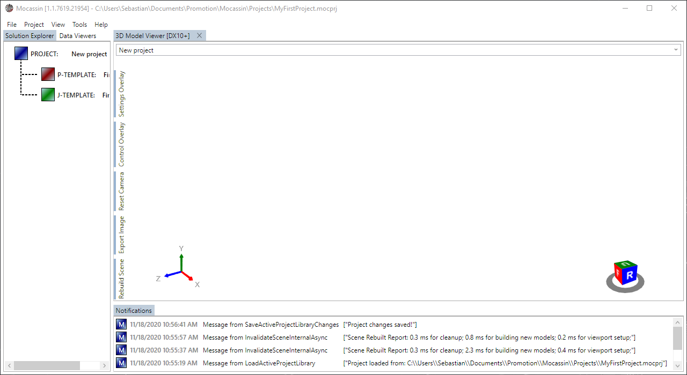
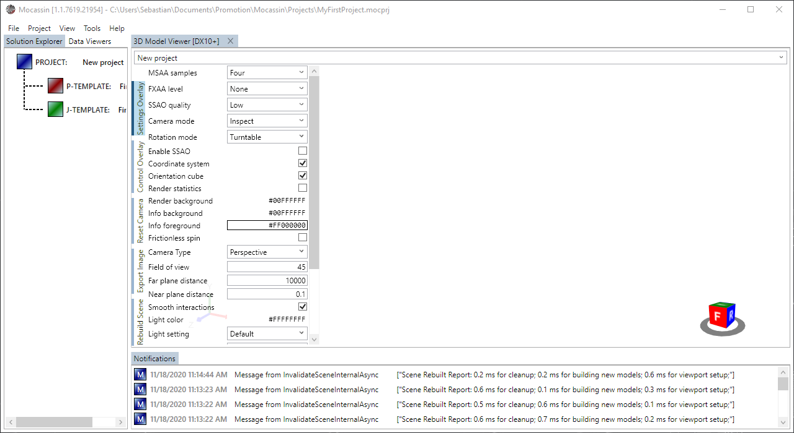
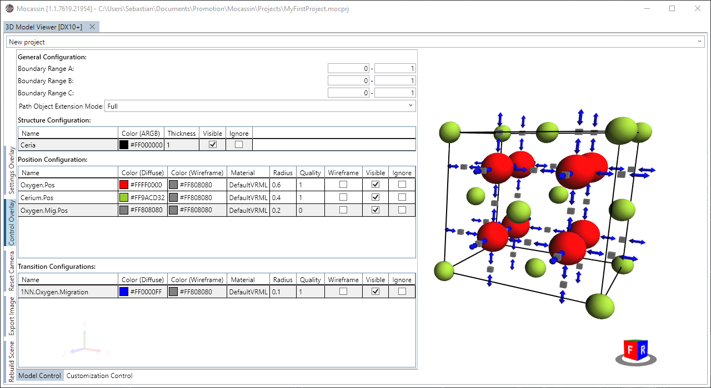
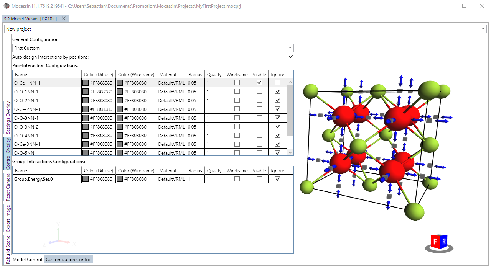

# The 3D viewer (DX10+)

## Description

A new 3D viewer is added by selecting "View > 3D Model Viewer (DX10+)" from the main menu bar of the main window. It is possible to have multiple viewers targeting the same viewer.

## Usage

### [The viewer menu bar](#the-viewer-menu-bar)

When a model is opened in the 3D viewer for the first time, no objects will be visible as shown in figure 1. The vertical menu bar to the left of the viewport provides the basic functionality, namely:

- *Settings Overlay*
  - Toggles the overlay for general viewport settings like MSAA, camera, background color, image export size, ...
- *Control Overlay*
  - Toggles the overlay for manipulating the display of model objects including cell sites, cell frame, KMC transitions, and interactions
- *Reset Camera*
  - Resets the camera to default settings
- *Export Image*
  - Triggers an image export dialog with multiple pixel formats
- *Rebuild Scene*
  - Triggers a forced rebuild of the scene and reloads the model components

<figure style="text-align: center">
    
    <figcaption>
    Figure 1: The 3D viewer has a vertical menu bar at the left side of the viewport which provides most of the functionality.
    </figcaption>
</figure>

### [The settings overlay](#the-settings-overlay)

Most settings of for the viewport should be self-explanatory. A notable exception is the 'Batching Mode' which defines how much static geometry batching the viewport is allowed to do. Setting this to higher values is useful to display huge cells will many objects efficiently at the cost of increased GPU memory consumption.

<figure style="text-align: center">
    
    <figcaption>
    Figure 2: The settings overlay allows to control basic settings for the viewport.
    </figcaption>
</figure>

### [The control overlay](#the-control-overlay)

The control overlay provides two sub-controls: (i) the model control and (ii) the customization/parameterization control. The model control allows to manipulated how the model objects are visualized, that is, cell sites, KMC transitions paths, and the unit cell frame. Additionally it allows to set the cell boundaries and to define how symmetry extension of path definitions (transitions and interactions) should be done

**Note:** The color fields accept both hexadecimal ARGB notation and common literal color descriptions such as 'black', 'blue', or 'yellowgreen' (see [here](https://docs.microsoft.com/en-gb/dotnet/api/system.windows.media.colors?view=net-5.0) for supported color names). Additionally, setting the (mesh) quality of a site to '0' will cause it to be rendered as a cube rather than a sphere.

<figure style="text-align: center">
    
    <figcaption>
    Figure 2: The model control of the control overlay gives access to the visualization of the defined model objects.
    </figcaption>
</figure>

The parameterization control as shown in figure 3 gives access to the visualization of the contents of a parameterization template, that is, interactions. The system can automatically match the look of pair interactions to the color of the involved sites. Group interactions are rendered as polygon fans, thus group interactions with a 2D linear geometry can only be made visible by rendering the wireframe.

<figure style="text-align: center">
    
    <figcaption>
    Figure 3: The parameterization control of the control overlay gives access to the selection and visualization of the contents of a parameterization template.
    </figcaption>
</figure>