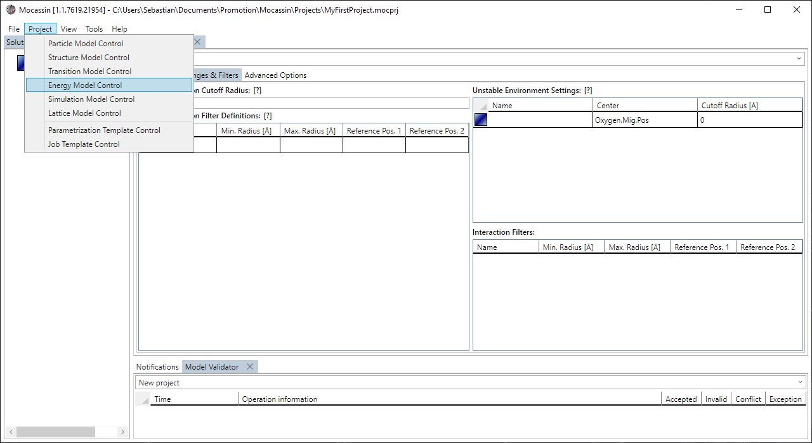
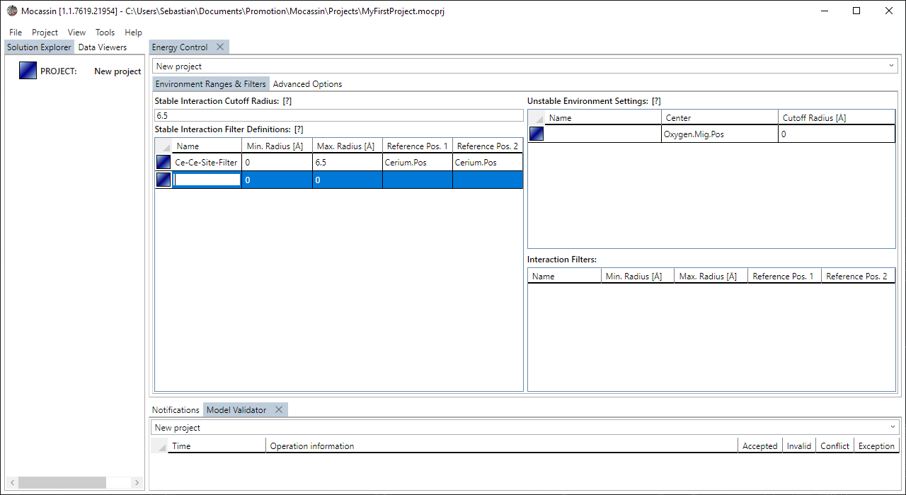
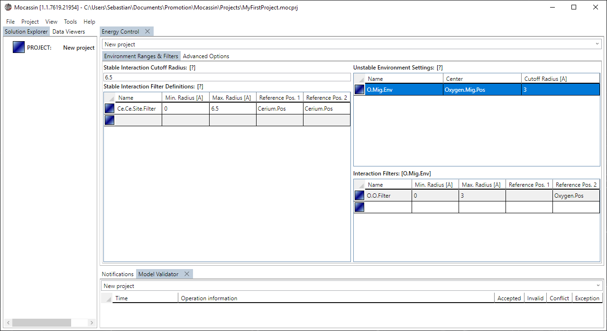
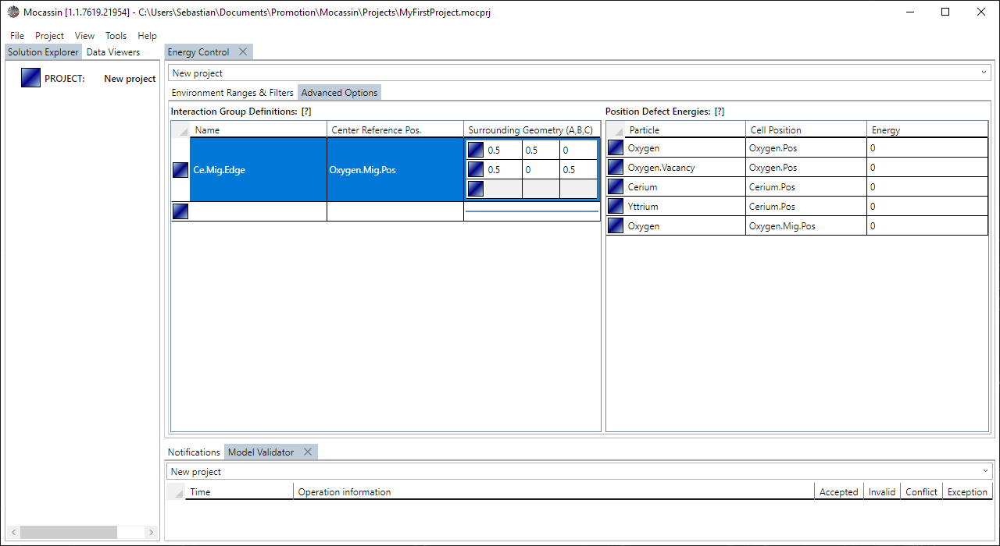
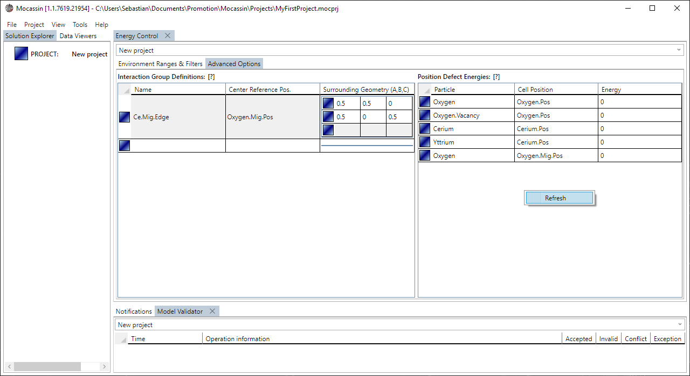

# The energy model control

## Description

The energy model control is the UI access to the [energy model](./energy-model.md) and allows to define environment cutoff radii, interaction filters, interaction clusters, and site energies.

## Usage

### [Add a new control tab](#add-a-new-control-tab)

To create a new particle control tab select "Project > Energy Model Control" from the main menu bar as shown in figure 1. The tab is added to the main tab control and automatically targets the currently active project if it is set.

<figure style="text-align: center">
    
    <figcaption>
    Figure 1: A new energy model control is added using the menu point: Project > Energy Model Control
    </figcaption>
</figure>

### [Define the stable environment constraints](#define-the-stable-environment)

The basic stable environment data for the automatic lookup of pair interactions is defined by settings the cutoff radius in the affiliated text box under the "Environment Range & Filters" subtab of the control. Additionally, the stable interaction filter grid allows to define hollow sphere filters that exclude interactions between two sublattices within a given radii range. A new filter is added by entering the placeholder element at the end of the affiliated data grid as shown in figure 2.

<figure style="text-align: center">
    
    <figcaption>
    Figure 2: A new interaction filter object is added by entering the placeholder element in the affiliated data grid.
    </figcaption>
</figure>

### [Define the unstable environment constraints](#define-the-stable-environment)

The basic unstable environment data for the automatic lookup of pair interactions is defined by settings the cutoff radius in the affiliated data grid entry under the "Environment Range & Filters" subtab of the control. In contrast to the stable environment, each unstable lattice site has its own environment cutoff radii and filter set. The filter data can be accessed by selecting the affiliated entry in the top grid which automatically loads the filter set into the lower data grid as shown in figure 3. Filters for unstable sites cannot be assigned a first reference position, it is implicitly set to the site the environment is defined for. Right clicking the upper right grid brings up the context menu that allows to do a force reload of the environments, e.g. after an additional site was added to the [structure control](./ui-structure-control.md).

<figure style="text-align: center">
    
    <figcaption>
    Figure 3: The unstable filter set is accessed by selecting the entry to edit in the upper grid on the right side of the control.
    </figcaption>
</figure>

### [Define group interactions](#define-group-interactions-clusters)

Group interactions (clusters) are added by entering the placeholder element in the affiliated group definitions data grid in the "Advanced Options" subtab of the control. Each cluster is defined by its origin site (center) and the surrounding geometry as shown in figure 4. Each cluster is defined "around" the originally defined center site geometry and the vectors of the surroundings are absolute points in $(A,B,C)$ coordinates.

<figure style="text-align: center">
    
    <figcaption>
    Figure 4: A group interaction is added by filling out the placeholder element at the end of the affiliated data grid.
    </figcaption>
</figure>

### [Define site defect energies](#define-site-defect-energies)

The site defect energies, that is, a specific particle has an energy offset when sitting on a specific unit cell site, is defined by setting the values in the affiliated data grid in the "Advanced Options" subtab of the control. Right clicking the grid brings up the context menu, as shown in figure 5, which allows to perform a force refresh after changes to the [particle control](./ui-particle-control.md) or [structure control](./ui-structure-control.md) have been made without closing the energy control.

<figure style="text-align: center">
    
    <figcaption>
    Figure 5: The refresh option is available by opening the context menu with a right mouse click.
    </figcaption>
</figure>