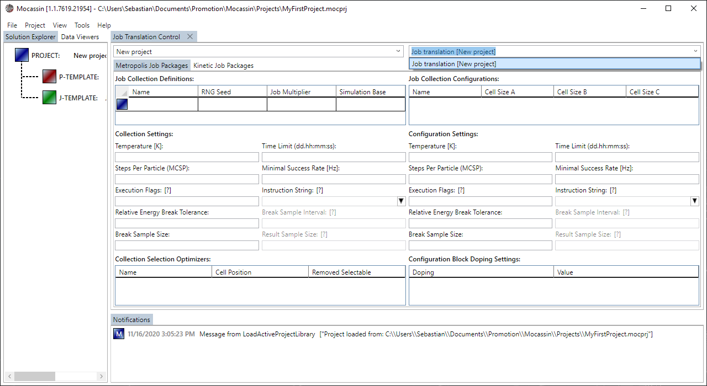
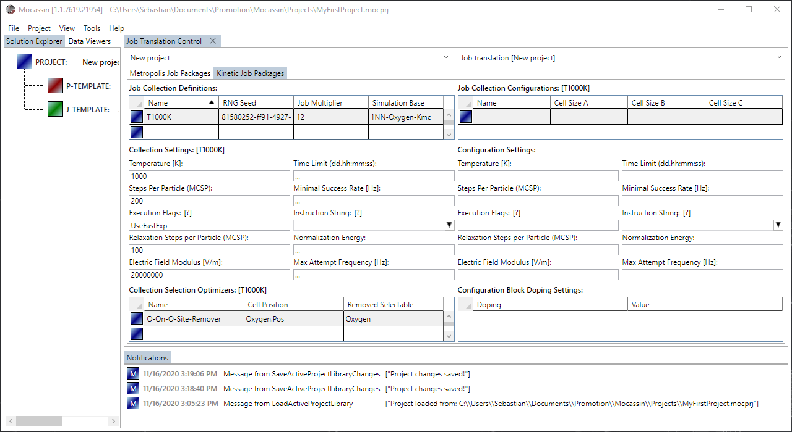
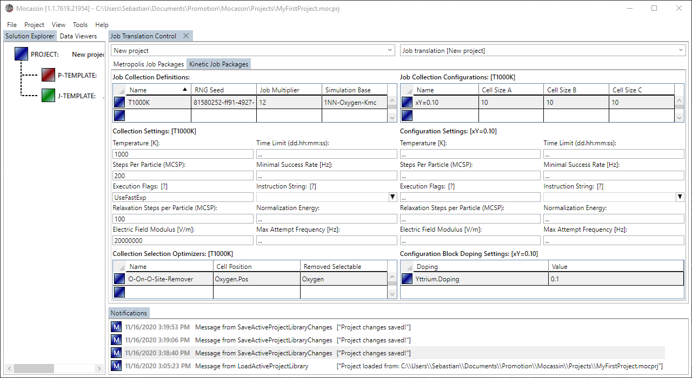

# The job template control

## Description

The job template control is the UI access to the [job templates](./job-templates.md) and allows to create and quantify large jobs sets for simulation deployment in terms of supercell size, statistical repetition, supercell doping, temperature, and others.

A new job template control is added by selecting "Project > Job Template Control" from the main menu bar. Job templates are created from the solution explorer as explained on the [managing projects page](./ui-managing-projects.md).

## Usage

### [Targeting a template](#targeting-a-template)

To access a job templates is has to be selected from the combo box right to the project selection box at the top of the control as shown in figure 1. Right clicking into the dropdown list also offers the same add/remove functionality for templates as provided by the solution explorer.

<figure style="text-align: center">
    
    <figcaption>
    Figure 1: A job template to modify is selected using the affiliated combo box. Typing in parts of the name also automatically selects the affiliated template.
    </figcaption>
</figure>

### [Creating a job collection](#creating-a-job-collection)

A job collection contains multiple subsets of job configurations that share common settings as explained on the [job templates page](./job-templates.md). All values that are visible in the data grid, namely, 'Name', 'Job Multiplier', and 'Simulation Base' need to be set. The value 'RNG Seed' will be automatically filled with a new GUID value, which is usually sufficient. The stack of text boxes below the selection data grid allows to set the shared settings for the collection. Additionally, Mocassin has no mechanisms to automatically detect the optimal selection principle for your simulation. It is thus recommended to remove majority species from the selection process by creating selection optimizers in the data grid in the lower left corner. A typical configuration for a job collection might look like as shown in figure 2.

**Warning:** In complex models with many multiple mobile species and mechanisms, removing the majority species from each lattice site might render the simulation physically meaningless. Always be aware of what your are simulating and choose the selection optimization accordingly. Additionally, for implementation reasons, intersticialy mechanisms cannot be executed starting at a vacancy, thus never remove the 'pushing' species from selection if simulating this type of mechanism.

<figure style="text-align: center">
    
    <figcaption>
    Figure 2: A job collection to modify is selected using the affiliated data grid element and a new one is added by entering the placeholder element.
    </figcaption>
</figure>

### [Creating a job configuration](#creating-a-job-configuration)

A job configuration belongs to a job collection and allows to overwrite all inherited settings, except for the mandatory ones described above. Additionally, the config requires the specification of the lattice sizes in $A,B,C$ direction and the quantification of the doping objects defined in the underlying model. A typical configuration for a job config might look like as shown in figure 3.

**Important:** Creating a doping that causes the supercell to have no valid transitions is not prevented by the model system. In this case, the simulator will register that the transition pool is empty and terminates with an error directly after the simulation data is loaded.

<figure style="text-align: center">
    
    <figcaption>
    Figure 3: A job configuration to modify is selected using the affiliated data grid element and a new one is added by entering the placeholder element.
    </figcaption>
</figure>

