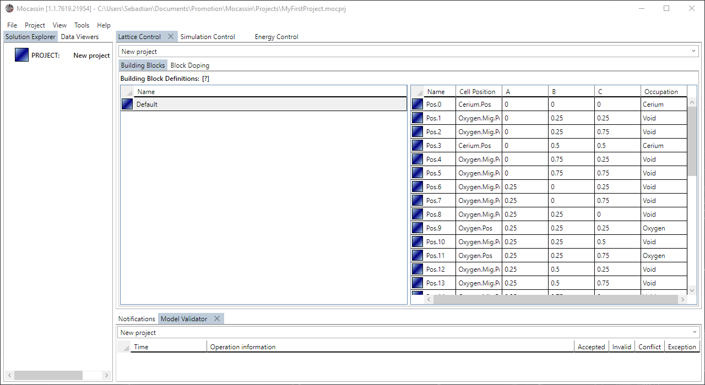
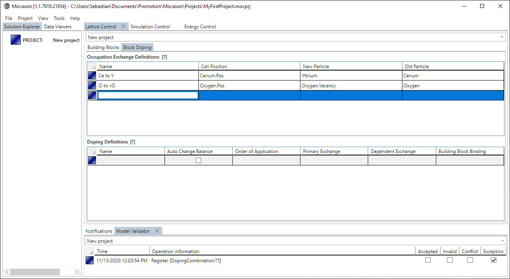
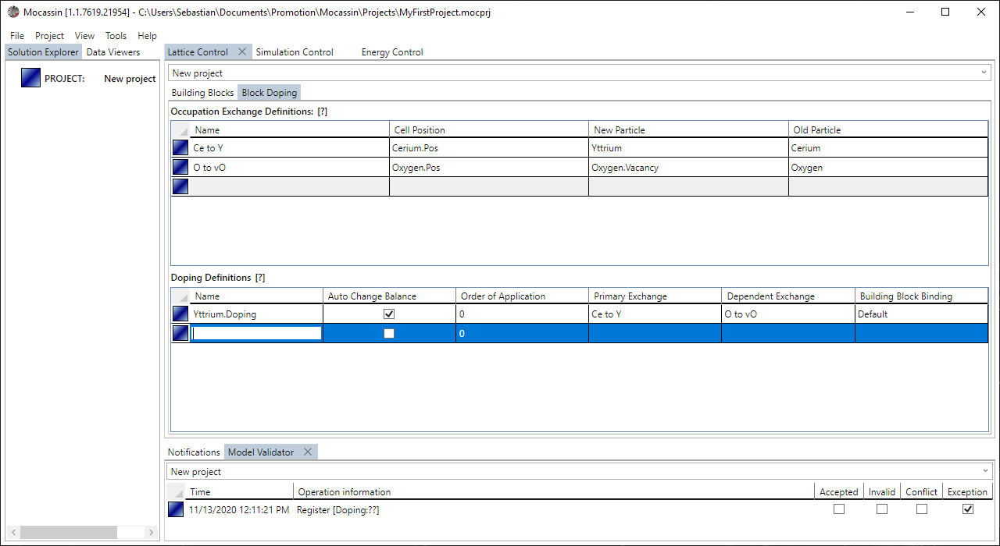

# The lattice model control

## Description

The simulation model control is the UI access to the [lattice model](./lattice-model.md) and allows to view the default unit cell occupations and to define dopings for supercell generation. The dopings are later quantified for each simulation job using [job templates](./job-templates.md).

## Usage

### [Add a new control tab](#add-a-new-control-tab)

To create a new lattice control tab select "Project > Lattice Model Control" from the main menu bar as shown in figure 1. The tab is added to the main tab control and automatically targets the currently active project if it is set.

<figure style="text-align: center">
    
    <figcaption>
    Figure 1: A new simulation model control is added using the menu point: Project > Energy Model Control
    </figcaption>
</figure>

### [View the default unit cell](#view-the-default-unit-cell)

The default unit cell occupation can be viewed in the "Building Blocks" subtab of the control as shown in figure 2. It is currently not supported to create custom building blocks. The default occupation of each stable position is the first particle of the particle set assigned to the site in the [structure control](./ui-structure-control.md) and the void particle for all unstable positions.

<figure style="text-align: center">
    
    <figcaption>
    Figure 2: The default unit cell can be viewed by selecting the default entry in the left data grid.
    </figcaption>
</figure>

### [Define an occupation exchange](#define-an-occupation-exchange)

Occupation exchange definitions can be added by entering the placeholder element at the end of the affiliated data grid in the "Block Doping" subtab of the control as shown in  figure 3.

<figure style="text-align: center">
    
    <figcaption>
    Figure 3: An occupation exchange is added by entering the placeholder element at the end of the data grid.
    </figcaption>
</figure>

### [Define a doping](#define-a-doping)

Doping definitions can be added by entering the placeholder element at the end of the affiliated data grid in the "Block Doping" subtab of the control as shown in figure 4. The dependent exchange has to be set only if the system should enforce automated charge balancing. The dopings defined here will be available for quantification in the [job templates](./job-templates.md).

<figure style="text-align: center">
    
    <figcaption>
    Figure 4: A doping is added by entering the placeholder element at the end of the data grid.
    </figcaption>
</figure>