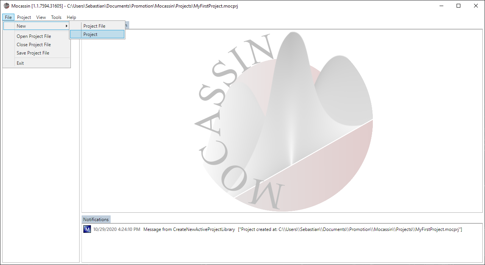
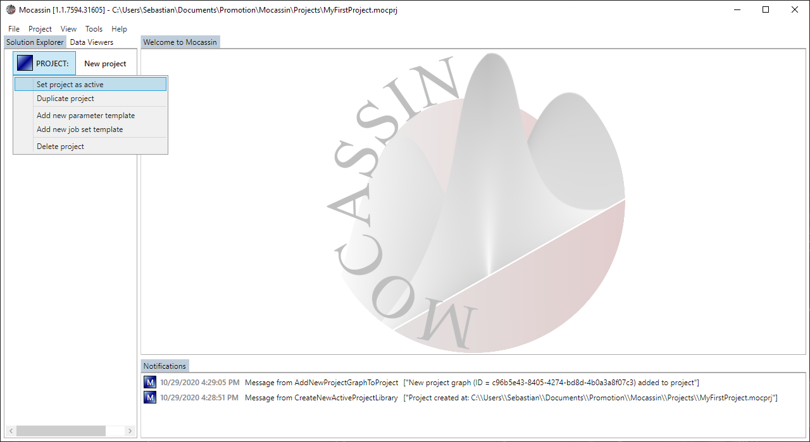
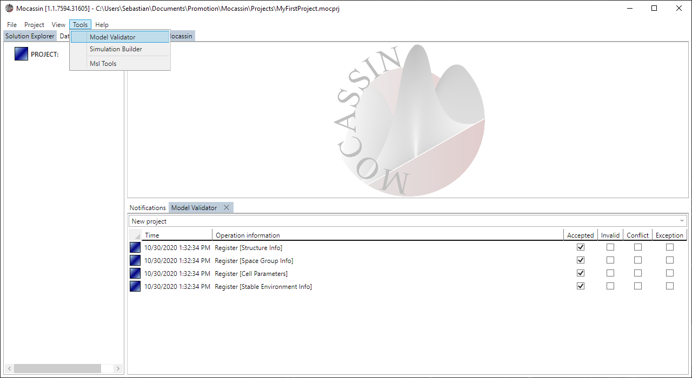

# Creating and managing projects with the GUI

## Description

The UI uses project files (.mocprj) to store all data relevant to a model. Each project can contain an arbitrary number of model projects. This section explains how to create project files, add individual projects, and duplicate or remove existing projects within a project file. All projects and affiliated templates contained in a project file are displayed as a tree view in the "Solution Explorer" tab of the left tab host of the main window.

## Usage

### [Creating a new project file](#creating-a-new-project-file)

A new project file can be created by using the menu bar at the top of the main application window. Select "File > New > Project File" as shown in figure 1. When the file dialog opens, select a target file for your project. Trying to replace existing projects using this dialog will fail. After the project is created it is automatically loaded and the main window header should show the path to the loaded project.

<figure style="text-align: center">
    
    <figcaption>
    Figure 1: Creating a new project file by using the menu option: File > New > Project File.
    </figcaption>
</figure>

### [Adding a new model project](#adding-a-new-model-project)

As long as a project is open, a new model project can be added to the project file by selecting "File > New > Project" from the main menu bar as shown in figure 2. After the command is executed, a blue box with a project named "New project" will appear in the "Solution Explorer" located at the left tab host of the main window.

<figure style="text-align: center">
    
    <figcaption>
    Figure 2: Add a new model project to the currently opened project file by using the menu option: File > New > Project.
    </figcaption>
</figure>

### [Managing a model project](#managing-a-model-project)

The project header in the solution explorer opens a context menu on left click as shown in figure 3. There are several menu points available:

- *Set project as active*
  - Sets the model project as active which causes all newly opened control tabs to automatically target this project
- *Duplicate project*
  - Creates a deep copy of a project file and optionally of all affiliated templates
- *Add new parameter template*
  - Creates and adds a new parameterization template affiliated with the model project. This action fails if the model has unresolved validation errors
- *Add new job set template*
  - Creates and adds a new job template affiliated with the model project
- *Delete project*
  - Deletes the project and all affiliated templates. This action has to be confirmed.

<figure style="text-align: center">
    
    <figcaption>
    Figure 3: Left clicking on the header of a model project opens the context menu that provides management options.
    </figcaption>
</figure>

### [Validating a model project](#validating-a-model-project)

Mocassin has a build in validation system for model definitions that catches most obvious input mistakes and informs about ill defined objects. A new validator tab can be opened by selecting "Tools > Model Validator" on the main menu bar as shown in figure 4 and validation of a project is started by selecting the project name from the dropdown menu at the top of the validator control. The validator is hooked to the model definition and automatically reevaluates the model each time a change is detected.

<figure style="text-align: center">
    
    <figcaption>
    Figure 4: Open a new model validator tabby using the menu option: File > New > Project and then selecting your project name from the dropdown menu at the top of the validator tab.
    </figcaption>
</figure>

By right clicking in the validator control, a context menu opens that allows to configurate the control:

- *Show errors only*
  - If checked, the validator shows only reports about model objects that contain any kind of error
- *Show target selection*
  - If unchecked, the project selection box is collapsed and no longer visible
- *Deactivate auto updates*
  - If checked, the validator will no longer react to changes made to the model