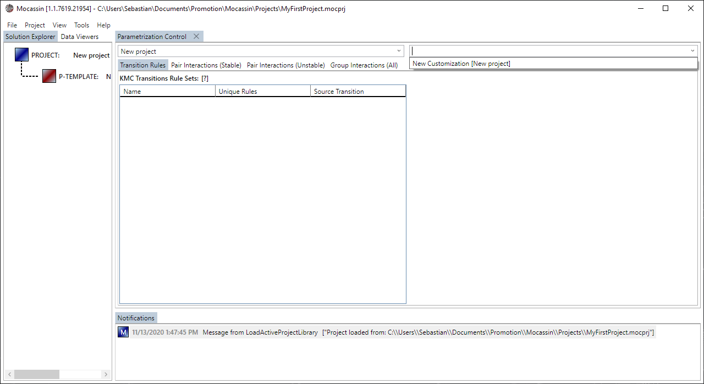
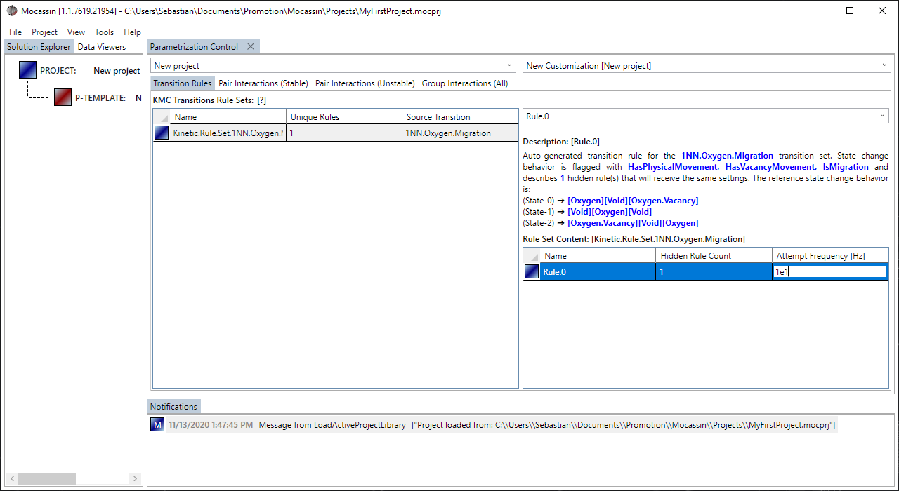
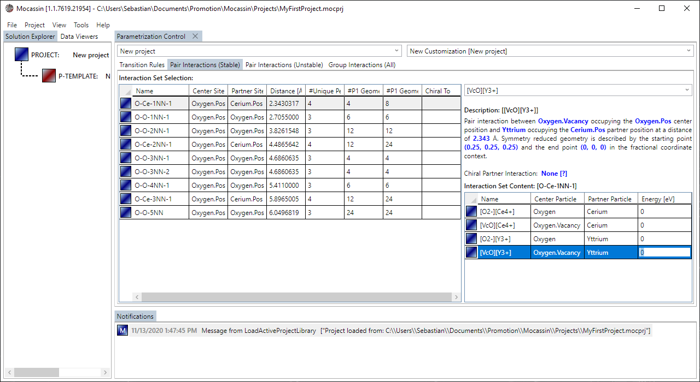

# The parameterization template control

## Description

The parameterization template control is the UI access to the [parameterization templates](./parameterization-templates.md) and allows to quantify the KMC attempt frequencies and interaction energy datasets that where created based on the available model data.

A new parameterization control is added by selecting "Project > Parameterization Template Control" from the main menu bar. Parameterization templates are created from the solution explorer as explained on the [managing projects page](./ui-managing-projects.md). This action will fail with an error box if the model contains any unresolved validation errors.

## Usage

### [Targeting a template](#targeting-a-template)

To access a parameterization templates is has to be selected from the combo box right to the project selection box at the top of the control as shown in figure 1. Right clicking into the dropdown list also offers the same add/remove functionality for templates as provided by the solution explorer.

<figure style="text-align: center">
    
    <figcaption>
    Figure 1: A parametrization to modify is selected using the affiliated combo box. Typing in parts of the name also automatically selects the affiliated template.
    </figcaption>
</figure>

### [Setting attempt frequencies](#setting-attempt-frequencies)

A KMC transition rule set is created for each defined transition in the model and listed under the "Transition Rules" subtab of the control as shown in figure 2. Each set may contain one or more independent rules that provide a description, the three involved states, an allow to modify the attempt frequency.

<figure style="text-align: center">
    
    <figcaption>
    Figure 2: The contents of an auto created transition rule can be viewed by selecting the rule in the affiliated data grid.
    </figcaption>
</figure>

### [Setting interaction energies](#setting-interaction-energies)

Interaction sets to modify the stable pair interactions, unstable pair interactions, and group interactions are created based on the model definition and listed in the "Pair Interactions (stable)", "Pair Interactions (unstable), and "Group Interactions (All)" subtabs, respectively, as shown in figure 3. Each set provides a symmetry reduced set of occupation permutations and a description with a reference geometry. It should be noted that pair interactions are automatically labelled according to the following pattern using '-' as the separator:

1. The default particle of the first site
2. The default particle of the second site
3. The distance-dependent shell index of this specific (1.)-(2.) site pair + 'NN' (Nearest Neighbor)
4. An index 1,2,3,... if if multiple shells of the same type exist that can be distinguished by symmetry
5. An option label 'a' or 'b' in cases where an interaction produces a vector set that is chiral to another at the same distance. (Technically equivalent to 'left' or 'right' rotating)

Chiral entries are linked and automatically pass any changes to their chiral partner. The reason they are listed is that the symmetry operations of the space group obviously has to respect the chirality and thus requires both sets to exist. However, no energy calculation program, such as DFT, will be able to calculate distinct energy values for a 'chiral' pair interaction.

**Note:** The DX10+ 3D viewer supports customized visualization of pair and group interactions from a parameterization template, with and without symmetry extension to $P1$.

<figure style="text-align: center">
    
    <figcaption>
    Figure 3: The contents of the auto created interaction sets can be viewed by selecting the set in the affiliated subtab and data grid.
    </figcaption>
</figure>