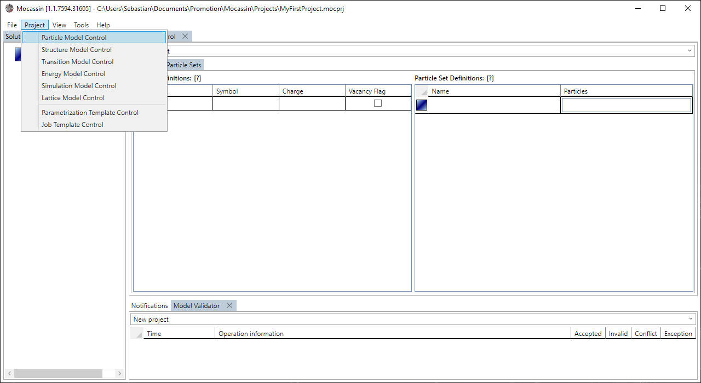
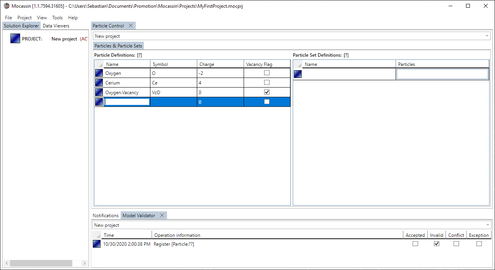
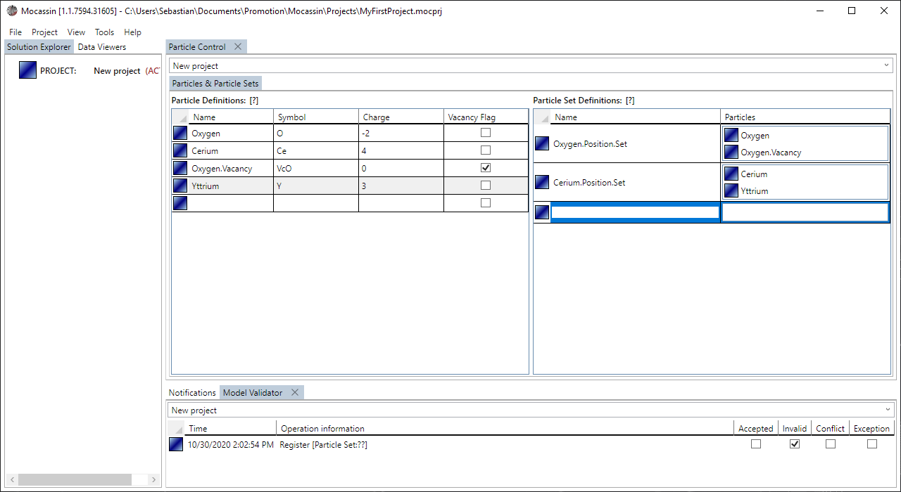

# The particle model control

## Description

The particle model control is the UI access to the [particle model](./particle-model.md) and allows to define particle and particle set objects through data grids. Note that the maximum number of custom particles is 63 and that the non-interacting "Void" particle is always implicitly defined as the index "0". During simulation each particle can be identified by its index, that is, the first custom particle defined in the list has the index "1".

## Usage

### [Add a new control tab](#add-a-new-control-tab)

To create a new particle control tab select "Project > Particle Model Control" from the main menu bar. The tab is added to the main tab control and automatically targets the currently active project if it is set.

<figure style="text-align: center">
    
    <figcaption>
    Figure 1: A new particle model control is added using the menu point: Project > Particle Model Control
    </figcaption>
</figure>

### [Define a particle](#define-a-particle)

A particle is added by entering the placeholder element at the end of the "Particle Definitions" data grid as shown in figure 2. The particle is fully defined by assigning a name, symbol, charge, and optionally setting the vacancy flag if required. 

<figure style="text-align: center">
    
    <figcaption>
    Figure 2: A new particle object is added by entering the placeholder element in the affiliated data grid.
    </figcaption>
</figure>

### [Define a particle set](#define-a-particle-set)

A particle set is added by entering the placeholder element at the end of the "Particle Set Definitions" data grid as shown in figure 3. The particle set is fully defined by assigning a name and particle list. The particles are added by drag & drop from the particle definitions list.

<figure style="text-align: center">
    
    <figcaption>
    Figure 3: A new particle set object is added by entering the placeholder element in the affiliated data grid and then particles are added by drag & drop.
    </figcaption>
</figure>