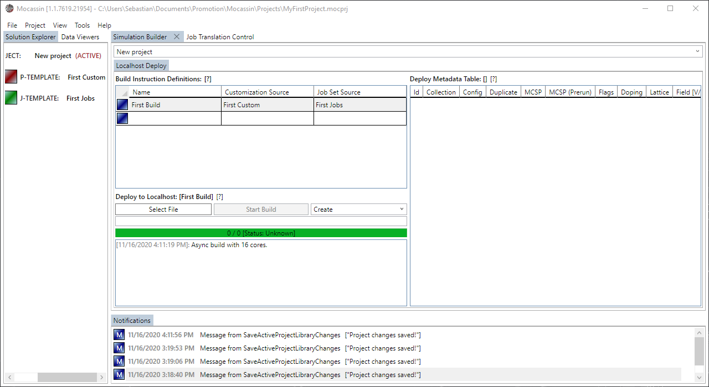
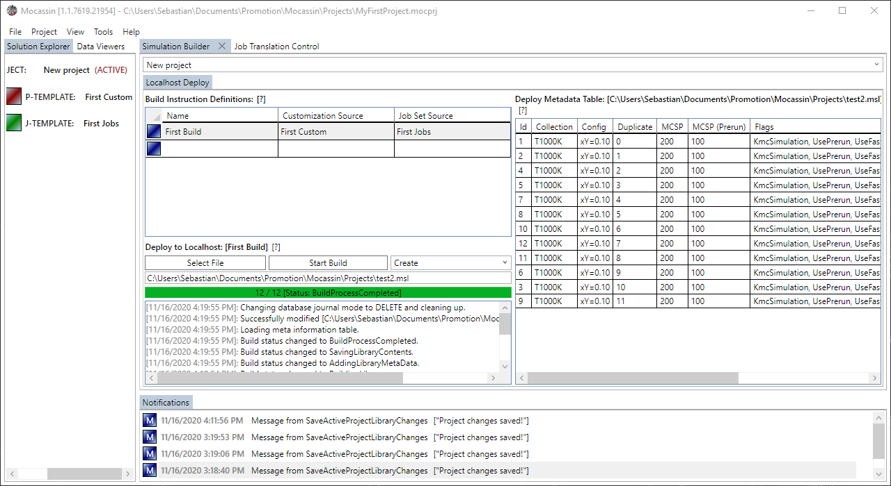

# The simulation build control

## Description

The simulation build control combines a model, parameterization template, and job template into a build instruction that is translatable into a simulation database for job processing with the simulator. It further allows to perform the translation process and deploy the database to the localhost.

A new simulation build control is added by selecting "Tools > Simulation Builder" from the main menu bar.

## Usage

### [Defining a new build instruction](#defining-a-new-build-instruction)

Build instructions can only be defined for the currently selected model, as this limits the available set of parameterizations and job templates. The customization source and job set source values can be set by using the combo boxes of the data grid elements and refer to the parameterization template and job template, respectively. A valid instruction looks as shown in figure 1.

<figure style="text-align: center">
    
    <figcaption>
    Figure 1: A build instruction to modify is selected using the affiliated data grid element and a new one is added by entering the placeholder element.
    </figcaption>
</figure>

### [Deploy a translation to localhost](#deploy-a-translation-to-localhost)

To invoke a build instruction and deploy the database to the localhost, select the instruction to translate from the affiliated data grid. Then use the 'Select File' button to trigger a file selection dialog to select a deploy target to save to. Pressing 'Start Build' then translates the model and writes the resulting jobs to the selected database file. On success, the builder should load parts of the meta data table of the SQLite database and display it as shown in figure 2.

**Note:** It is possible to select between a 'Create' and 'Append' mode for the database creation. The former overwrites and existing database, the latter adds the new build to an existing database. The 'Append' feature is intended to enhance an existing database with exactly the same build again after it was discovered that the selected number of samples was insufficient. Mixing entirely different build instructions in the same database is not recommended as it complicates querying and grouping of the results from the database latter.

<figure style="text-align: center">
    
    <figcaption>
    Figure 2: A build instruction to modify is selected using the affiliated data grid element and a new one is added by entering the placeholder element.
    </figcaption>
</figure>