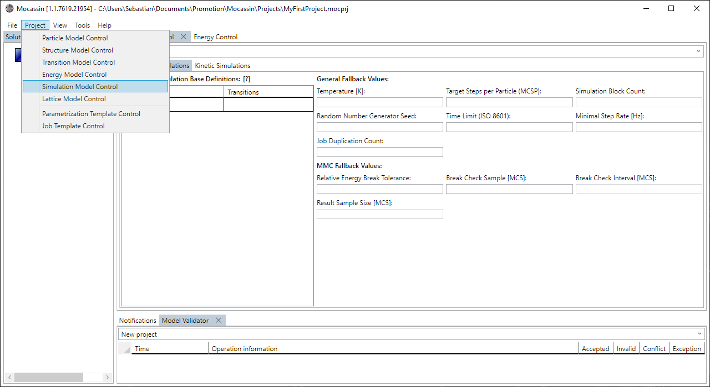
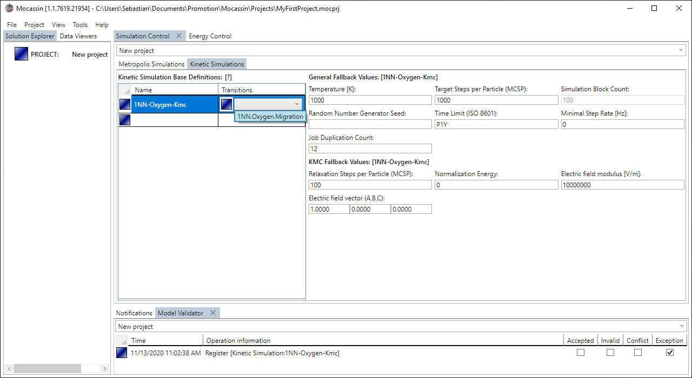

# The simulation model control

## Description

The simulation model control is the UI access to the [simulation model](./simulation-model.md) and allows to define environment KMC/MMC simulation base definitions with affiliated default simulation parameters. These definitions serve as the basis for later generation of large sets of simulation jobs with job templates.

## Usage

### [Add a new control tab](#add-a-new-control-tab)

To create a new simulation control tab select "Project > Simulation Model Control" from the main menu bar as shown in figure 1. The tab is added to the main tab control and automatically targets the currently active project if it is set.

<figure style="text-align: center">
    
    <figcaption>
    Figure 1: A new simulation model control is added using the menu point: Project > Simulation Model Control
    </figcaption>
</figure>

### [Define a KMC/MMC simulation base](#define-a-kmcmmc-simulation-base)

To create a new MMC or KMC simulation enter the placeholder element in the affiliated data grid in the "Metropolis Simulation" or "Kinetic Simulation" subtab of the control, respectively. Transitions can be assigned by double clicking the placeholder element, which brings up a selection box as shown in figure 2. When a simulation entry is selected, the fallback settings of the simulation can be set in the text boxes on the right side of the grid.

**Note**

<figure style="text-align: center">
    
    <figcaption>
    Figure 2: A transition is assigned to a simulation base by using the drop down menu of the placeholder element. Each transition can have an arbitrary number of assigned transitions.
    </figcaption>
</figure>