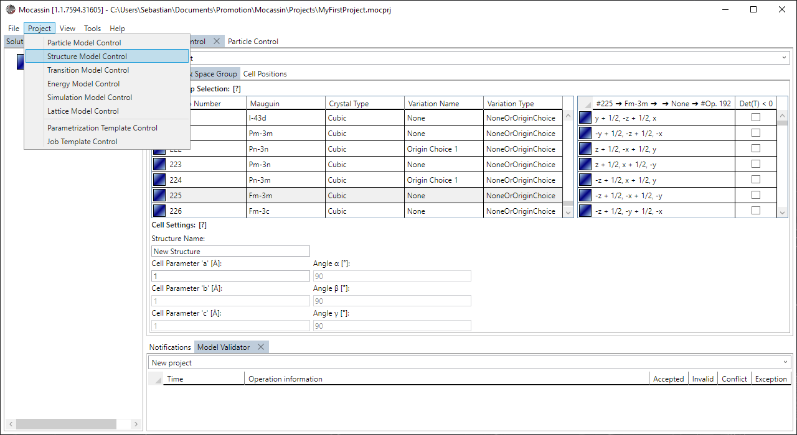
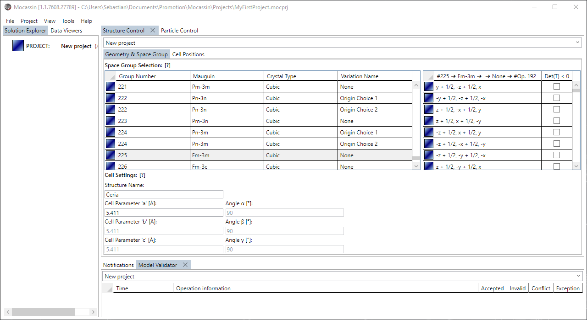
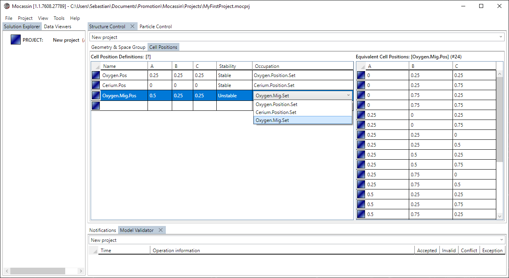

# The structure model control

## Description

The structure model control is the UI access to the [structure model](./structure-model.md) and allows to define the space group, unit cell geometry, and unit cell sites. Mocassin ships with a space group database that contains 274 entries for the 230 existing space groups. Custom space group definitions are currently not supported. Note that KMC simulations required unstable cell sites to be defined like regular Wyckoff positions to model the transition sites.

## Usage

### [Add a new control tab](#add-a-new-control-tab)

To create a new structure control tab select "Project > Structure Model Control" from the main menu bar. The tab is added to the main tab control and automatically targets the currently active project if it is set. The structure control has two subtabs that provide access to "Geometry & Space Group" settings and "Cell Position" definitions. 

<figure style="text-align: center">
    
    <figcaption>
    Figure 1: A new structure model control is added using the menu point: Project > Structure Model Control
    </figcaption>
</figure>

### [Setting the space group and cell parameters](#setting-the-space-group-and-cell-parameters)

The first subtab "Geometry & Space Groups" of the structure control allows to select a space group from the internal space group database and then set the cell parameters and angles accordingly as shown in figure 2. The system automatically overwrites and sets properties to readonly that cannot be set independently in the crystal system of the selected space group.

<figure style="text-align: center">
    
    <figcaption>
    Figure 2: The space group, cell parameters, and angles can be controlled from the first subtab.
    </figcaption>
</figure>

### [Define a unit cell site](#define-a-unit-cell-site)

A cell site is added by entering the placeholder element at the end of the "Cell Position Definitions" data grid on the "Cell Positions" subtab as shown in figure 3. The site is fully defined by assigning a name, the $A,B,C \in [0...1)$ position data, selecting the stability, and selecting the affiliated particle set that defines the occupation.

<figure style="text-align: center">
    
    <figcaption>
        Figure 3: A new cell site object is added by entering the placeholder element in the affiliated data grid.
    </figcaption>
</figure>