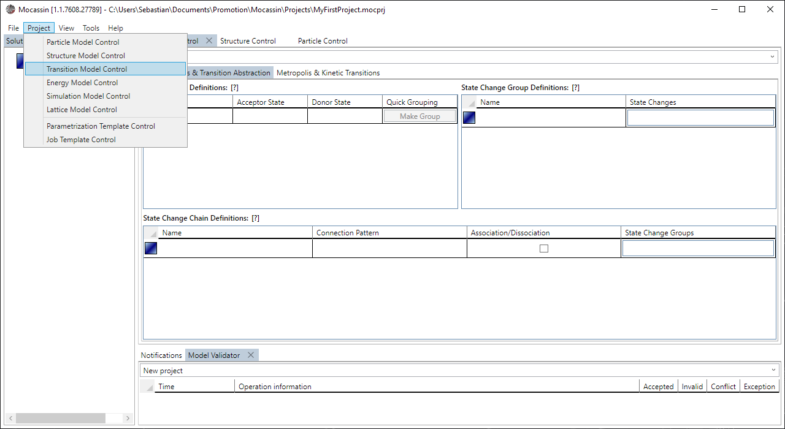
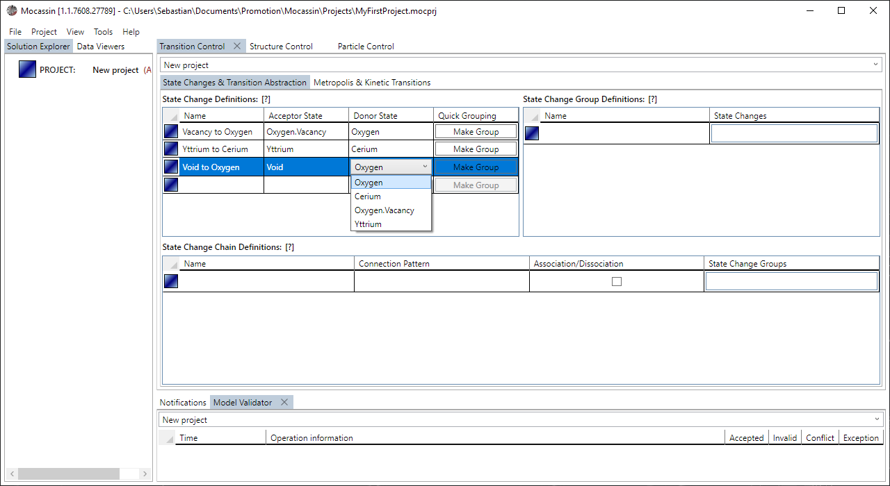
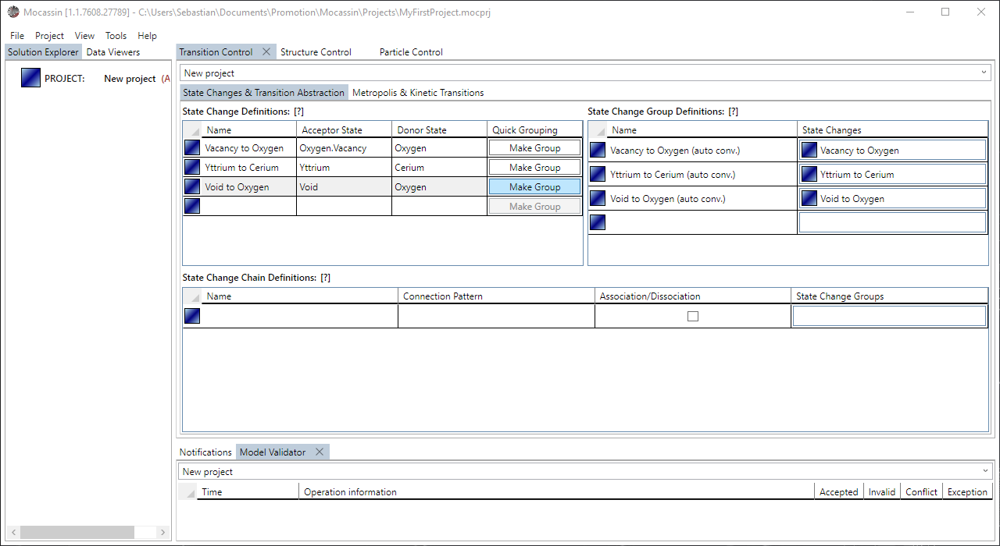
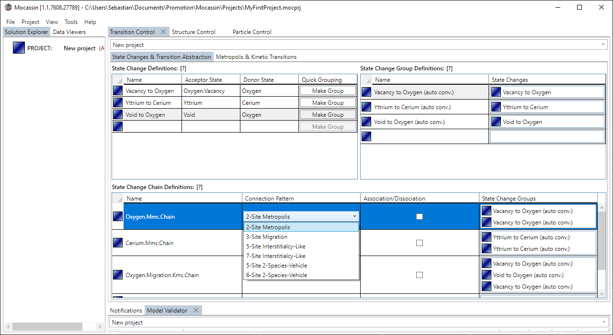
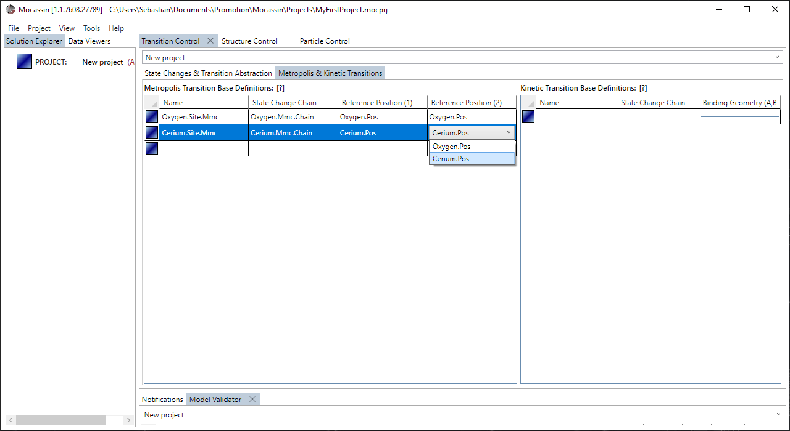
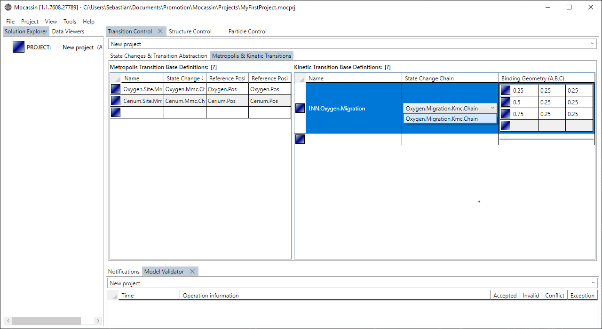

# The transition model control

## Description

The transition model control is the UI access to the [transition model](./transition-model.md) and allows to define the state changes, abstract process chains, and MMC or KMC transitions. MMC and KMC definitions can be generated in the same model but cannot be combined in a single simulation later.

## Usage

### [Add a new control tab](#add-a-new-control-tab)

To create a new transition control tab select "Project > Transition Model Control" from the main menu bar. The tab is added to the main tab control and automatically targets the currently active project if it is set. The transition control has two subtabs that provide access to "State Changes & Transition Abstraction" and "Metropolis & Kinetic Transitions". 

<figure style="text-align: center">
    
    <figcaption>
    Figure 1: A new transition model control is added using the menu point: Project > Transition Model Control
    </figcaption>
</figure>

### [Define a state change](#define-a-state-change)

A state change object is added by entering the placeholder object of the "State Change Definitions" data grid in the "State Changes & Transition Abstraction" subtab of the control as shown in figure 2. Each state change object is fully defined by a name, the acceptor state, and the donor state. Clicking the "Make Group" button creates and adds state change group that contains only that state change.

<figure style="text-align: center">
    
    <figcaption>
    Figure 2: A new state change object is added by entering the placeholder element in the affiliated data grid.
    </figcaption>
</figure>

### [Define a state change group](#define-a-state-change-group)

A state change group object is added by entering the placeholder object of the "State Change Group Definitions" data grid in the "State Changes & Transition Abstraction" subtab of the control as shown in figure 3. Each state change group object is fully defined by a name and a set of state changes. In the majority of cases, using the "Make Group" button in the state change definitions is the preferred way to create these objects.

<figure style="text-align: center">
    
    <figcaption>
    Figure 3: A new state change object is added by entering the placeholder element in the affiliated data grid or using the "Make Group" buttons.
    </figcaption>
</figure>

### [Define a state change chain](#define-a-state-change-chain)

A state change group object is added by entering the placeholder object of the "State Change Chain Definitions" data grid in the "State Changes & Transition Abstraction" subtab of the control as shown in figure 4. Each state change chain object is fully defined by a name, a connection pattern selection, and a sequence of state change groups that matches the selected pattern. The state change groups are added by drag & drop from the state change group definition data grid.

<figure style="text-align: center">
    
    <figcaption>
    Figure 4: A new state change chain is added by entering the placeholder element in the affiliated data grid and the state change group sequence is defined by drag & drop.
    </figcaption>
</figure>

### [Define a metropolis transition](#define-a-metropolis-transition)

A Metropolis transition object is added by entering the placeholder object of the "Metropolis Transition Base Definitions" data grid in the "Metropolis & Kinetic Transitions" subtab of the control as shown in figure 5. Each Metropolis transition object is fully defined by a name, an MMC state change chain, selection of the reference site of the first sublattice, and selection of the reference site of the second sublattice.

<figure style="text-align: center">
    
    <figcaption>
    Figure 5: A new MMC transition is added by entering the placeholder element in the affiliated data grid.
    </figcaption>
</figure>

### [Define a kinetic transition](#define-a-kinetic-transition)

A kinetic transition object is added by entering the placeholder object of the "Kinetic Transition Base Definitions" data grid in the "Metropolis & Kinetic Transitions" subtab of the control as shown in figure 5. Each kinetic transition object is fully defined by a name, an KMC state change chain, and a sequence of $A,B,C$ positions that describes one of the reference paths of the migration.

<figure style="text-align: center">
    
    <figcaption>
    Figure 6: A new KMC transition is added by entering the placeholder element in the affiliated data grid.
    </figcaption>
</figure>